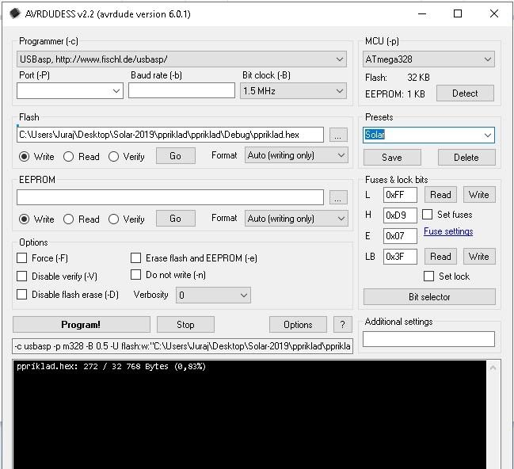
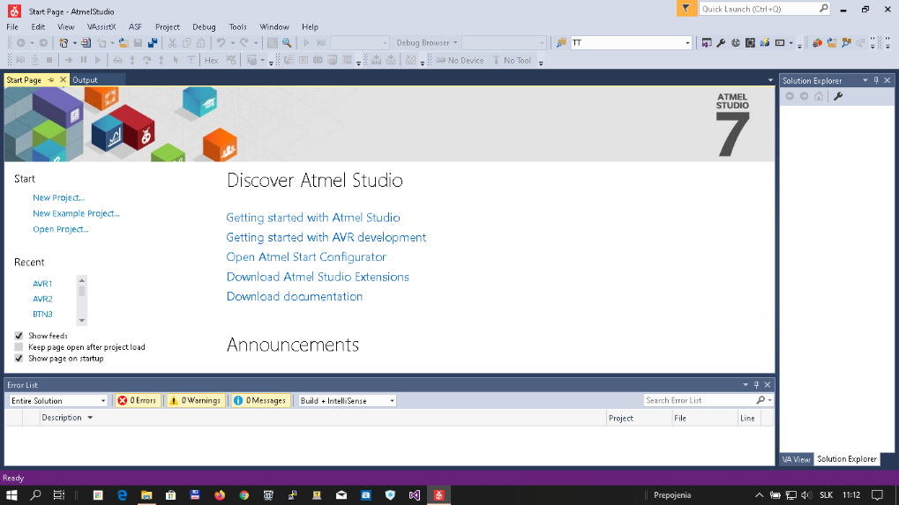
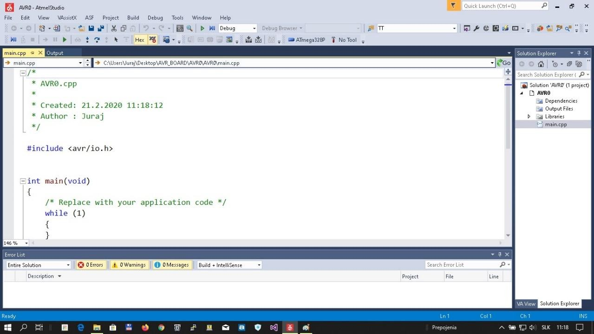

# BT-car3

**Stručný popis riadiaceho modulu AVR-board**

Podporný výučbový materiál na Letnú školu programovania vstavaných systémov 2020

## Predslov


Výučbový systém BT-car3 je primárne určený na výučbu programovania vstavaných systémov. Pri jeho návrhu autori vychádzali z predchádzajúcich skúseností s výučbou programovania na kurzoch, ktoré sa už tradične konajú na Katedre technickej kybernetiky, Fakulte riadenia a informatiky, Žilinskej univerzity. Tieto jednotýždňové kurzy sú určené pre tých poslucháčov stredných škôl, ktorí majú záujem zoznámiť sa s problematikou vývoja vstavaných systémov, ako elektronických zariadení riadených mikrokontrolérom. Je zrejmé, že na tak obmedzenom priestore nie je možné prebrať všetky problémy vývoja aplikácií vstavaných systémov, preto aj zameranie kurzu má viac popularizačný a zábavný charakter ako v prípade klasickej výučby. Z tohto dôvodu je aj zariadenie BT-car3 navrhnuté tak, aby umožnilo v relatívne krátkom čase vyvinúť zábavnú, no funkčnú aplikáciu. 

Autori dúfajú, že takáto forma výučby, pri ktorej sa každý krok, každá zmena kódu prejaví aj na zmene správania sa zariadenia bude pre účastníkov kurzu dostatočne zaujímavá a podnetná. Podobne predpokladajú, snáď vhodnejšie dúfajú, že aspoň niektorí účastníci týchto kurzov sa budú ďalej venovať tejto zaujímavej problematike - **vývoju vstavaných systémov.**


## Koncepcia

Systém BT-car3 je navrhnutý ako skladačka, ktorá zatiaľ obsahuje dva základné komponenty - modul MCU a aplikačný modul. Takto koncipovaný systém umožňuje zostaviť širokú škálu úloh s rôznou náročnosťou podľa úrovne študentov.


- **Modul MCU** (zatiaľ len AVR-board) predstavuje jednoduchý programovateľný modul s vybraným typom mikrokontroléra (MCU) ATmega328P. V najbližšom období predpokladáme rozšíriť stavebnicu o modul s 32-bitovým MCU STM32G030. Tento modul po pripojení na počítač umožňuje vývoj širokej škály aplikácií od tých najjednoduchších, ako napr. ovládanie RGB LED diódy, až po zložité programové moduly, ako napr. sériová komunikácia s prerušením a vyrovnávacou pamäťou. Modul v tomto režime je napájaný z USB portu hosťujúceho počítača prostredníctvom programátora USBASP.
- **Aplikačný modul** (zatiaľ Mobilná platforma) predstavuje akýsi rozširujúci modul, ktorý umožní vývoj a overenie zložitejších aplikácií. Aj v prípade mobilnej platformy predpokladáme vývoj ďalších problémovo orientovaných modifikácií (bezdrôtové siete, automatizácia, meracie systémy, HMI a pod.). 

## Popis dosky/modulu MCU

Modul AVR-board obsahuje viaceré komponenty, ktoré dovoľujú používateľovi vyvíjať množinu aplikácií bez priamej potreby aplikačného modulu. V takomto autonómnom režime je doska napájaná prostredníctvom programátora AVR ISP (PROG) z USB portu počítača. 


!!! question "Aké úlohy umožňuje riešiť samotný modul AVR-board? "
	Uveďme aspoň niektoré:
	
	- ovládanie RGB LED diódy,
	- testovanie stlačenia užívateľského tlačidla,
	- ovládanie akustického návestia (bez prerušenia, s využitím PWM, s využitím prerušenia),
	- snímanie hodnoty napätia na fotoodpore,
	- množstvo ďalších úloh spojených s využívaním funkcií integrovaných v MCU (sériová komunikácia, WDT, energeticky úsporné režimy, generovanie časových úsekov a mnoho ďalších).
	
	Je zrejmé, že samotný modul AVR-board dovoľuje vyvíjať celú plejádu aplikácií vstavaných systémov.


###  Napájanie modulu AVR

- z aplikačného modulu cez konektor SV2. Napätie musí byť v rozsahu (3.3 – 5.5 V). 
- z programátora USBISP (konektor PROG). Napätie je voliteľné prepojkou na programátore (3.3V alebo 5V).

!!! warning "Upozornenie"
	podľa technickej dokumentácie mikrokontrolér pracuje v rozsahu napájacích napätí (2,7V až 5,5V). Pri nižšom napätí ako 3.3 V výrobca nezaručuje správnu činnosť MCU s frekvenciou 12MHz a vyššou. Podobne akustické návestie nemusí pri nižšom napätí správne pracovať (rozsah pracovných napätí je 3V – 5V).

### Oscilátor

Externý kryštál 12 MHz, alebo interný RC oscilátor 1 MHz. **Voľbu je možné vykonať prostredníctvom „fuse bitov“ MCU v procese programovania obvodu.** Pri dodaní je AVR-board nastavený na interný RC OSC. 

### Rozmiestnenie vývodov AVR-board

Rozmiestnenie vývodov AVR-board je uvedené na nasledujúcom obrázku. Význam jednotlivých vývodov udáva tabuľka.


> Tabuľka vývodov
>
| **Pin** |                        **Označenie**                         |                          **Alt 1**                           |                          **Alt 2**                           |  **Alt 3**  |
| :-----: | :----------------------------------------------------------: | :----------------------------------------------------------: | :----------------------------------------------------------: | :---------: |
|  **1**  |                           **PD6**                            | <div title="MOTOR 1" class="w3-container w3-red" >**OC0A**</div> |                           **AIN0**                           | **PCINT22** |
|  **2**  |                           **PD5**                            | <div title="MOTOR 1" class="w3-container w3-red" >**OC0B**</div> |                            **T1**                            | **PCINT21** |
|  **3**  |                           **PD3**                            | <div title="MOTOR 2" class="w3-container w3-gray">**OC2B**</div> |                           **INT1**                           | **PCINT19** |
|  **4**  |       <div title="GY-ON, OPT-ON" class="w3-container w3-blue">**PB2**</div>        |                           **OC1B**                           |                            **SS**                            | **PCINT2**  |
|  **5**  |       <div title="GY-ON, OPT-ON" class="w3-container w3-blue">**PB1**</div>        |                           **OC1A**                           |                                                              | **PCINT1**  |
|  **6**  |       **PB0**       |                           **CLK0**                           |                           **ICP**                            | **PCINT0**  |
|  **7**  |                           **PB3**                            |                           **MOSI**                           | <div title="MOTOR 2" class="w3-container w3-gray">**OC2A**</div> | **PCINT3**  |
|  **8**  |                           **PB4**                            |                           **MISO**                           |                                                              | **PCINT4**  |
|  **9**  |                           **PB5**                            |                           **SCK**                            |                                                              | **PCINT5**  |
| **10**  |                           **GND**                            |                                                              |                                                              |             |
| **11**  |                           **ADC7**                           |                                                              |                                                              |             |
| **12**  |                           **RES**                            |                                                              |                                                              |             |
| **13**  |                           **PC0**                            | <div title="OPT0" class="w3-container w3-green" >**ADC0**</div> |                                                              | **PCINT8**  |
| **14**  |                           **PC1**                            | <div title="OPT1" class="w3-container w3-green" >**ADC1**</div> |                                                              | **PCINT9**  |
| **15**  |                           **PC2**                            | <div title="OPT2" class="w3-container w3-green" >**ADC2**</div> |                                                              | **PCINT10** |
| **16**  | <div title="SLEEP" class="w3-container w3-purple" >**PC3**</div> |                           **ADC3**                           |                                                              | **PCINT11** |
| **17**  |                           **PC4**                            |                           **ADC4**                           | <div title="I2C" class="w3-container w3-yellow" >**SDA**</div> | **PCINT12** |
| **18**  |                           **PC5**                            |                           **ADC5**                           | <div title="I2C" class="w3-container w3-yellow" >**SCL**</div> | **PCINT13** |
| **19**  |                           **Vcc**                            |                                                              |                                                              |             |
| **20**  |                            **NC**                            |                                                              |                                                              |             |
| **21**  |                           **GND**                            |                                                              |                                                              |             |
| **22**  |                           **GND**                            |                                                              |                                                              |             |
| **23**  |                           **PD0**                            | <div title="BlueTooth" class="w3-container w3-orange">**RXD**</div> |                                                              | **PCINT16** |
| **24**  |                           **PD1**                            | <div title="BlueTooth" class="w3-container w3-orange">**TXD**</div> |                                                              | **PCINT17** |

> !!! note "Poznámka"
 	V tabuľke sú farebne vyznačené tie vývody, ktoré sa využívajú v aplikačnom module na riadenie konkrétnych komponentov (mostíky motorov, modul BlueTooth a pod.),  alebo na snímanie hodnôt vybraných veličín (optické snímače...).<br/>
    <button class="w3-container w3-red">**Motor 1**</button><button class="w3-container w3-gray">**Motor 2**</button><button class="w3-container w3-purple">**Sleep**</button><button class="w3-container w3-blue">**GY-ON**</button><button class="w3-container w3-blue">**OPT-ON**</button><button class="w3-container w3-orange">**BlueTooth**</button><button class="w3-container w3-yellow">**I2C**</button><button class="w3-container w3-green">**OPT1,OPT2,OPT3**</button>


### Hlavné parametre MCU ATmega328P

Pretože základný prvok modulu MCU je ATmega328P uveďme aspoň jeho hlavné parametre:

**Pamäťový podsystém:** 

​	Flash: 32kB SRAM: 2kB EEPROM: 1kB; 

**Jadro:**

​	AVR® 8-bit, frekvencia do 20MHz
> Schématická značka
> 
---

> Púzdro
> 

### Schéma modulu AVR-board


### Rozloženie vývodov na doske AVR-board


## Popis aplikačného modulu

Aplikačný modul je určený na rozšírenie funkcionalít dosky MCU. Modul predstavuje pohyblivú platformu, ktorej správanie je definované užívateľským programom, prípadne diaľkovo, na základe príkazov z mobilného telefónu. Predpokladáme, že práve možnosť programovania pohybu mobilnej platformy obohatí klasickú výučbu programovania. Mobilná platforma obsahuje:

- komunikačný podsystém BlueTooth HC-05,
- zdroj napájania (batéria Li-ion 18650) a lineárny stabilizátor LDO 3.3V,
- dvojitý H-mostík na ovládanie DC motorov,
- optické snímače pracovnej plochy,
- konektor na modul gyroskopu,
- konektor na modul ultrazvukového snímača vzdialenosti HC-SR04,
- konektor na modul snímania gest APDS 9960 akonektor na pripojenie modulu MCU.


>  Bloková schéma aplikačného modulu.
>
> 

V tejto časti nebudeme podrobne popisovať funkciu a obvodové riešenie uvedených podsystémov. Konkrétne zapojenie a funkcia jednotlivých blokov bude popísaná v nasledujúcich častiach, pri návrhu ich programovej obsluhy. Každému HW bloku bude odpovedať príslušná trieda, ktorá umožní jeho efektívne používanie.


## Vývoj programového vybavenia

Úvodom je potrebné zdôrazniť, že programové vybavenie sa vyvíja len pre modul MCU. Aplikačný modul neobsahuje programovateľné komponenty. V závislosti od toho aký mikrokontrolér je použitý na MCU module (STM, AVR...) je potrebné vybrať zodpovedajúce vývojové prostredie. V prípade, že budeme v prvom kroku používať modul AVR-board, vývojové prostredie bude Atmel Studio 7.0. 


Atmel Studio 7 je integrovaná vývojová platforma (IDP) určená na vývoj aplikácií pre triedy MCU AVR a SAM v asm, jazyku C a C++. Popis prostredia, ako aj samotnú integrovanú vývojovú platformu je možné nájsť na stránke https://www.microchip.com/mplab/avr-support/atmel-studio-7. Platforma umožňuje písať, simulovať, ladiť a kompilovať kód, ktorý programátor tvorí v editačnom okne aplikácie. Po úspešnej kompilácii kódu sa generuje binárny obraz, ktorý je uložený vo formáte hex. Tento je už vhodný na zavedenie do pamäte MCU.

Ako preniesť binárny obraz do pamäte programu MCU? Na tento krok potrebujeme programátor AVR ISP, ktorého najjednoduchšia verzia je uvedená na obrázku. 


Je dostupná napr. https://www.ebay.com/itm/10-Pin-Convert-to-Standard-6-Pin-Adapter-Board-USBASP-USBISP-AVR-Programmer-USB , prípadne z domácich zdrojov na https://www.tme.eu/sk/details/pololu-1300/programovatelne-kontrolery/pololu/usb-avr-programmer/ , kde je ale podstatne drahší. Nezabudnite ani na redukciu 10/6 vývodov, pretože modul MCU používa na pripojenie programátora 6-vývodový konektor. Príslušné ovládače a popis programátora je možné nájsť na https://www.fischl.de/usbasp/. Pretože na internete je pomerne veľa návodov, ako nainštalovať ovládače a integrovať ich do IDP Atmel studio nebudeme sa v tomto texte nimi zaoberať.

Teraz, keď už máme nainštalovanú IDP a s SW podporou programátora AVR ISP je možné dosku MCU pripojiť na programátor a nastaviť vhodné parametre MCU (Fuse a Lock bity) a zapísať ich do obvodu.

> Obrázok dokumentuje okno na programovanie modulu MCU AVR-board. 
>
> 

**Fuse bity** sú nastavené na použitie externého 12MHz kryštálu.

!!! warning "Pozor!"
	Pozor, nevhodným nastavením Fuse bitov môžete zvoliť taký zdroj hodinového signálu, ktorý je pre vašu aplikáciu nedostupný. Podobne opatrne pracujte aj s bitmi Lock určenými na uzamknutie pamäte. Všetky podrobnosti o práci s programátorom USBASP sú jednoducho dostupné na Internete.

Ešte jednu poznámku k vybaveniu pracoviska. Užitočnou pomôckou, ktorú v priebehu vývoja zložitejších aplikácií určite oceníte je obvod, ktorý zabezpečí konverziu medzi sériovou linkou UART a USB. Pomocou tohto prepojenia môžete počítač použiť ako referenčnú konzolu. 


Na PC je potrebné nainštalovať vhodný terminálový program, napríklad „TeraTerm“, nastaviť mu tie isté komunikačné parametre ako v MCU pre obvod UART a potom môžete používať klávesnicu a obrazovku svojho PC ako referenčnú konzolu na vypisovanie textov a zadávanie rôznych hodnôt. Kompletné pracovisko na vývoj aplikácií pozostáva z:

- personálneho počítača s nainštalovanou IDP,
- modul AVR-board,
- programátor USBASP s nainštalovanými ovládačmi,
- prevodník USB-UART najlepšie s originálnym obvodom FTDI, ktorý zaručuje automatickú inštaláciu podpísaných ovládačov.


!!! tip "Poznámka"
	V prípade, že použijete nákup prostredníctvom ebay alebo AliExpress náklady neprekročia 10 €. (Samozrejme predpokladáme, že počítač už máte.) Je možné využiť i domácich dodávateľov modulov USBASP a USBUART. Je to rýchlejšie, ale výrazne drahšie.

Teraz, keď už máme všetko pripravené, otvoríme IDP AtmelStudio 7 a môžeme začať písať prvý projekt. Nebudeme popisovať celý postup práce s IDP, pretože na nete existuje množstvo dobrých návodov, ktoré Vám umožnia zorientovať sa v obsluhe a nastavení prostredia. Preto len v krátkosti, po otvorení sa objaví úvodná stránka, na ktorej v ponuke zvolíte nový projekt (new project - vľavo).

V tomto okne zvolíte programovací jazyk, C/C++, alebo Assembler. V ponuke sú ešte pripravené riešenia od výrobcu, ale o nich niekedy inokedy. Zvolíme C/C++ a v druhom stĺpci GCC C++ spustiteľný projekt (Executable Project). V spodnej časti je možné zvoliť umiestnenie a napísať názov nášho projektu, prípadne riešenia (AVR0). Po potvrdení – OK – prejdeme k ďalšiemu oknu, v ktorom vyberieme konkrétny typ MCU. Pripomeniem, že používame MCU ATmega328P. Preto ho vyberieme z ponúkaného zoznamu. Po výbere MCU našu voľbu potvrdíme tlačidlom OK.
>Dialógové okno nového projektu
>
---
> Výber správneho MCU ATmega328P
>
> Filtrovanie podľa názvu "328"
>

Následne sa objaví pracovné okno, v ktorom už môžeme tvoriť náš projekt. Všimnite si, že IDE Vám pripravilo šablónu, do ktorej môžete písať užívateľský kód. Pri generovaní štandardných súčastí projektu boli vytvorené súbory, ktoré sú zobrazené v okne prehliadača na pravej strane. Dvojklikom na súbor `main.cpp` sa Vám tento zobrazí v editačnom okne, pričom zatiaľ obsahuje len pár riadkov. V editačnom okne môžete dopĺňať/upravovať kód programu. V tomto bode sa s popisom zastavíme a odkážeme Vás na odbornú literatúru z oblasti programovania AVR MCU. V budúcnosti to doplníme o podrobnejšie informácie. (Tvorba hlavičkového súboru, nových tried, nastavenie parametrov projektu a pod.). Teraz sa ale vráťme k BTcar.




## Hlavičkový súbor `BOARD_AVR.h`

Náš projekt „AVR0“ doplníme o hlavičkový súbor `BOARD_AVR.h`. Tento súbor má zabezpečiť zjednodušenie prístupu k obvodovým prostriedkom, pomocou:

- užívateľsky príjemnejších názvov:	 
	``` c++
	#define LED_BLUE  PORTD2
	```
- definovaných makier:  
	``` c++
	#define sbi(x,y) x |= (1<<y)
	```
- konštánt súvisiacich s obvodovým riešením: 
	``` c++ 
	#define F_CPU 12000000UL
	```

Takéto riešenie, v ktorom sú technické parametre obsiahnuté v hlavičkovom súbore zvyšuje možnosti opätovného použitia projektu aj pri malých zmenách obvodového riešenia. (Je zrejmé, že HW zmeny stačí aktualizovať v hlavičkovom súbore, pričom ďalšie súčasti projektu ostávajú nezmenené).

```c++
#ifndef BOARD_AVR_H_
#define BOARD_AVR_H_

#define F_CPU 12000000UL	/* Define CPU clock Frequency e.g. here its 8MHz */
#include <avr/io.h>		/* Include AVR std. library file */
#include <util/delay.h>	/* Include delay header file */
#include <inttypes.h>	/* Include integer type header file */
#include <stdlib.h>		/* Include standard library file */
#include <stdio.h>		/* Include standard library file */

/********Definicie uživateľskych makier********************************/
#define sbi(x,y) x |= (1<<y)	//nastav bit     
#define cbi(x,y) x &= ~(1<<y)   //nuluj bit - using bitwise AND operator
#define tbi(x,y) x ^= _BV(y)    //zmen bit - using bitwise XOR operator

/********LED DIODA********************************/
#define LED_BLUE  PORTD7
#define LED_GREEN  PORTD2
#define LED_RED  PORTD4
//********************AKU**************************************
#define AKU  PORTB1
//********************USART**************************************
#define TXD PORTD1
#define RXD PORTD0
#define BAUDERATE	9600  //115200	//1200 
#define UBRR_VALUE ((F_CPU / (BAUDERATE * 8L)) -1)

//******************MOTOR DRIVER LEFT  *********************************
#define AIN1_D PORTD6		// IN1, IN2  PWM  0  dopredu/brzda
#define AIN2_D PORTD5		//            1  PWM  dopredu/vybeh  
#define MSLEEP_C PORTC3		// motor sleep L-SLEEP, H-run

//******************MOTOR DRIVER RIGHT  *********************************
#define BIN1_B PORTB3		// IN1, OC2A
#define BIN2_D PORTD3		// IN2, OC2B

//*******************GYRO a ACC MPU ****************************************
#define MPU_ON PORTB2		//  L --> ON
#define MPU_SCL PORTC5
#define MPU_SDA PORTC4

//*******************OPTIKA ****************************************
#define OPT_ON PORTB1		//  L --> ON
#define O_RIGHT PORTC2			// ADC channel
#define O_LEFT  PORTC0			// ADC channel
#define O_ZAD   PORTC1			// ADC channel

#define FOTORES	6			// ADC channel

//*******************TLACIDLO ****************************************
#define TL PORTB0		//  L --> ON
//*******************TIMER1****************************************
enum delic_hodin{
	dSTOP,
	d1,
	d8,
	d64,
	d256,
	d1024,
	EXT_F,
	EXT_R
};

#endif /* BOARD_AVR_H_ */
```

!!! note  "Hodiny je účelné definovať podmienene"
	``` c++
	#ifndef F_CPU
	#define F_CPU 12000000UL
	#endif
	```
	Je to z dôvodu zadefinovania štandardnej hodnoty hodín, ktorú môžeme neskôr prepísať. 

Teraz by bolo vhodné vysvetliť riadok po riadku význam jednotlivých definícií a ako ich môžeme pri tvorbe kódu využívať. Poznamenávam, že pri tvorbe hlavičkového súboru musí programátor vychádzať zo schémy zapojenia. Schéma zapojenia je samozrejme potrebná aj pri objasnení významu jednotlivých riadkov hlavičkového súboru.

Takto sme úspešne rozšírili projekt o hlavičkový súbor, ktorý definuje vzťah ku konkrétnemu hardvéru. Tento hlavičkový súbor tvorí akýsi spojovací mostík medzi programom a konkrétnym hardvérom. Oddeľuje programátora od konkrétneho obvodového riešenia. Programátor už nemusí vedieť, že napr. modrá LED dióda je zapojená medzi Ucc a vývod PD7. O toto konkrétne priradenie sa postará hlavičkový súbor. (`#define LED_BLUE PORTD7`). Samozrejme, predpokladáme, že v ďalšom programe sa pri manipulácii s diódou využíva len symbolické označenie `LED_BLUE`. Poznamenávam, že môžete využívať aj pôvodné označenie `PORTD7`, kompilátor to akceptuje. Je však zrejmé, že znižujete prenositeľnosť aj čitateľnosť programu. Po doplnení projektu bude Solution explorer rozšírený o náš hlavičkový súbor `BOARD_AVR.h`, viď. obr.


