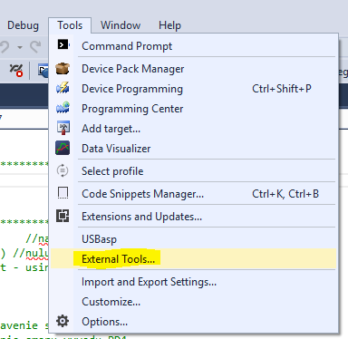
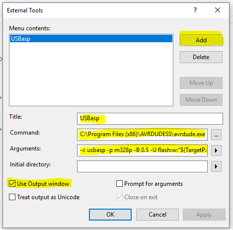
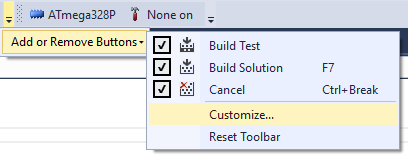
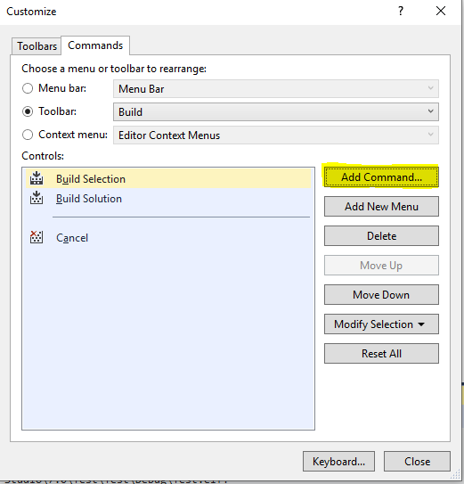
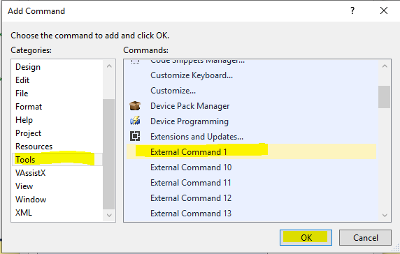
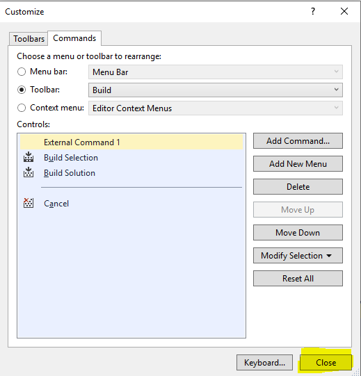
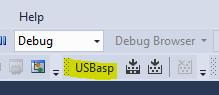

## Inštalovanie USBasp

[Youtube návod](https://www.youtube.com/watch?v=kPcgjkQn2eE)

USBasp Home Page: [https://www.fischl.de/usbasp/](https://www.youtube.com/redirect?q=https%3A%2F%2Fwww.fischl.de%2Fusbasp%2F&redir_token=QUFFLUhqbWhwQ252SXFiWWVkZTNySFFFRldQSFlwYzZwQXxBQ3Jtc0ttdUM1SzVTc1l5Ql9tQ3RzYndPN2xYNVJUZlNyeDQ2T1d6VUwyZ1RFOEtneGZVOVJoelNYY1c2a1pyNXkybVROZnNLV0lxTGl3dDVXSDRFZ0NfcC1tMldBZnYyTjgtTkhZeHU1eUhQZWNLXzVqbTRSZw%3D%3D&v=kPcgjkQn2eE&event=video_description)  

Download avrdude: [http://download.savannah.gnu.org/rele...](https://www.youtube.com/redirect?q=http%3A%2F%2Fdownload.savannah.gnu.org%2Freleases%2Favrdude%2F&redir_token=QUFFLUhqazYwZ1hIY2M2RnBxdnU2U3VHMXdKNzA4dnlEZ3xBQ3Jtc0trRlBDdVZRNXk2bENHQTZPdnlRczJFZTJrcWtOUEFBOUxXS3FHQ2kybHdDTUJacU5JLTI2QmdOWHdEbnVmOWQtdE1nSVJpU1NqZXpBcWpCbmx4UGxpU2N4Z1hwelAwT3VoRGZZZmhOeTM1TmZSYnZyZw%3D%3D&v=kPcgjkQn2eE&event=video_description)  

USBasp Driver Installation Help: [https://electronics.stackexchange.com...](https://www.youtube.com/redirect?q=https%3A%2F%2Felectronics.stackexchange.com%2Fquestions%2F416714%2Favrdude-does-not-recognize-usbasp-device%2F417509%23417509&redir_token=QUFFLUhqa2NqS1pjbGJsQjZmeXJUcmVFUE42RGZSU3FDUXxBQ3Jtc0tuMU1VTzgxdGFxRlVlQTF3ZEdfV25ERzlhbk9GSW5xVU5ucW8yN281N1NqcFBXZGszT0ZPSFVORXRRWjN1SUhtdndtQVJFZzZMZFNaSFBlX002SVhzYWtzSVVsTEROMkVBcGpqaHFNYzNsVURjZGpyZw%3D%3D&v=kPcgjkQn2eE&event=video_description)  

Zadig USB Driver Installer: [https://zadig.akeo.ie/](https://www.youtube.com/redirect?q=https%3A%2F%2Fzadig.akeo.ie%2F&redir_token=QUFFLUhqbVBHa3RZcnNwUk9KU21LaVhiSDk4OWJVVEg0d3xBQ3Jtc0trSWtpNjdEWHpteDZOaFp1aVgxWVMzbzZkamFYeGJhYms1QUpEM1pXM1lwalJLQVFlYjY0M3lKWW5wUlRPRjZBMWRVMzg0QVc0UlNyRGMzWnJHS0gta0daWENMN3JuMXhHT1p2a2tqR0lPYzhLdS1SOA%3D%3D&v=kPcgjkQn2eE&event=video_description) 

[Avrdudess -  GUI](https://blog.zakkemble.net/avrdudess-a-gui-for-avrdude/)

## Projekt pre PlatformIO

[PlatformIO projekt](https://github.com/friktk/AvrLinux)

## Ako opraviť nedostatočné oprávnenia k programátoru USBasp v Linux (PlatformIO)

Ak sa pokúsite použiť ISP programátor [USBasp](http://www.fischl.de/usbasp/) v systéme Linux pod účtom bežného neprivilegovaného používateľa, zobrazí sa chybová správa:

```none
avrdude: Warning: cannot open USB device: Permission denied
avrdude: error: could not find USB device with vid=0x16c0 pid=0x5dc vendor='www.fischl.de' product='USBasp'
```

### Rýchla a špinavá oprava

Problém je v tom, že predvolené nastavenie pre nové zariadenia umožňujú zapisovať naň iba root uživateľovi. Pomocou príkazu `lsusb`môžete zistiť ID zbernice a zariadenia pripojeného zariadenia USBasp:

```bash
$ lsusb
...
Bus 003 Device 018: ID 16c0:05dc Van Ooijen Technische Informatica shared ID for use with libusb
...
$ ls -al /dev/bus/usb/003/018
crw-rw-r-- 1 root root 189, 273 23. Aug 11:23 /dev/bus/usb/003/018
```

Rýchle a špinavé riešenie je jednoducho zmeniť povolenia pre nové zariadenie ručne. Nevýhodou je, že tento postup musíte opakovať pri každom opätovnom pripojení zariadenia.

```bash
$ sudo chmod 666 /dev/bus/usb/003/018
```

### Trvalé riešenie

Rozumnejším riešením je pridať pre zariadenie pravidlo [*udev*](https://linuxconfig.org/tutorial-on-how-to-write-basic-udev-rules-in-linux). Pravidlo *udev* jednoducho zodpovedá určitým vlastnostiam zariadenia po pripojení a vykonáva na ňom určité akcie, ako napríklad zmena povolení súborov.

Súbor [99-USBasp.rules](https://raw.githubusercontent.com/stefanbeller/USBasp/master/bin/linux-nonroot/99-USBasp.rules) <a href="https://raw.githubusercontent.com/stefanbeller/USBasp/master/bin/linux-nonroot/99-USBasp.rules" download>99-USBasp.rules</a> obsahuje predpripravený skript pre naše zariadenie USBasp. Po stiahnuti jednoduchým prikazom z terminalu nainštalujete tento skript do systému.

```bash
$ sudo cp 99-USBasp.rules /etc/udev/rules.d/
```


## Programovanie priamo z prostredia Atmel Studio

Pre zjednodušenie nahrávania programu do MCU je  vhodné si nastaviť tzv. "externý nástroj" v prostredí Atmel studio, ktorý zavolá externý program `avrdude` a nahrá program do MCU priamo z prostredia. Nasledujúce obrázkové kroky zobrazujú postup ako to docieliť.

**Krok 1** - Pridanie nového externého nástroja

 

**Krok 2** - Zadanie parametrov pre nový nástroj



Do riadku *Command* zadajte cestu k programu `avrdude.exe`, ktorý je súčasťou programu *AVRDUDESS*. Pri štandartnej inštalácii je tento program umiestnený tu:

``` bash
C:\Program Files (x86)\AVRDUDESS\avrdude.exe
```

Do riadku *Arguments* zadajte nasledovné argumenty: 
```bash
-c usbasp -p m328p -B 0.5 -U flash:w:"$(TargetPath)":a

```
**Krok 3** - pridanie odkazu na nový externý program do Toolbar lišty



**Krok 4**



**Krok 5**



**Krok 6**



**Krok 7** - Na záver pribudne nový odkaz na externý program.

