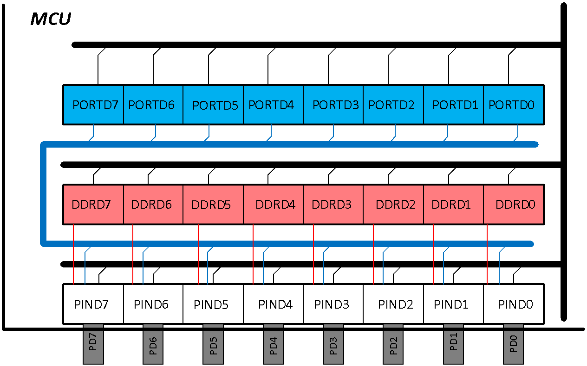
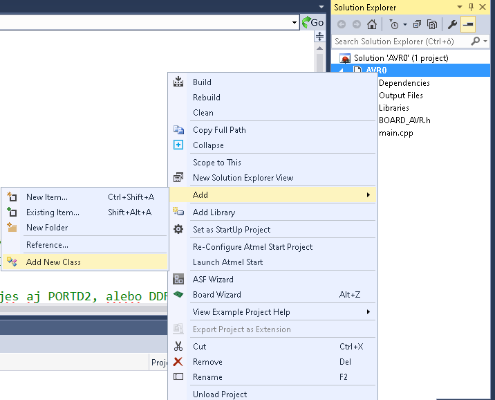

**Projekt AVR0**

Venujme sa vývoju prvej, snáď najjednoduchšej aplikácie, v jazyku C++, ktorá bude využívať uvedený hlavičkový súbor. Vytvorme prvý projekt, ktorý bude periodicky zasvecovať farby na RGB LED dióde v poradí červená, zelená a modrá. Každá farba nech svieti 0,5s a potom sa rozsvieti nasledujúca. Tento proces sa bude opakovať donekonečna, až pokiaľ neodpojíme napájacie napätie. Pretože modul AVR-board je napájaný prostredníctvom programátora z USB portu počítača, bude fungovať až do odpojenia programátora. Na obrázku je uvedená časť schémy, z ktorej budeme vychádzať pri tvorbe projektu. 


AVR-board je napájaný prostredníctvom programátora z USB portu počítača, bude fungovať až do odpojenia programátora. Na obrázku je uvedená časť schémy, z ktorej budeme vychádzať pri tvorbe projektu. 

Všimnime si, že anódy svetelných diód sú pripojené na potenciál Ucc. Ak chceme, aby príslušná dióda sa zasvietila musíme jej katódu pripojiť na nižší potenciál ako Ucc-UF, kde UF predstavuje úbytok napätia na dióde v priepustnom smere. Tejto podmienke vyhovuje stav, pri ktorom na katódu diódy privedieme potenciál zodpovedajúci log. 0 (budem ho označovať L, na rozdiel od potenciálu H, ktorý zodpovedá log.1). Z uvedeného vyplýva, že ak chceme zasvietiť napr. modrú diódu musíme na vývod PD7 priviesť úroveň L a na PD4 - červená a PD2 - zelená úroveň H.

### Prvý krok

Aby to nebolo také jednoduché, je potrebné pred tým definovať, že vývody PD2, PD4 a PD7 budú v režime výstup. Toto vykonáme zápisom log.1 do registra smeru DDRD. Register DDRD sa nachádza vnútri obvodu a jeho obsah definuje režim činnosti brány D (PORTD). Preto prvý krok bude:

``` c++
sbi(DDRD,LED_RED);		// nastavenie smeru vyvodu PD4
sbi(DDRD,LED_GREEN);	// nastavenie smeru vyvodu PD2
sbi(DDRD,LED_BLUE);		// PD7, nic sa nestane ak pouzijes aj PORTD7, DDRD7 

```

Týmto sme s využitím makra definovaného v hlavičkovom súbore do príslušných bitov registra smeru DDRD zapísali log.1. Takto sme ich definovali ako výstupné. Teraz už stačí zapísať do príslušných bitov výstupného registra (PORTD) hodnotu log.0 pre modrú farbu a log.1 pre ostatné.

``` c++
sbi(PORTD,LED_RED);		// nastavenie hodnoty vyvodu PD4
sbi(PORTD,LED_GREEN);	// PD2
cbi(PORTD,LED_BLUE);	// PD7 

```

Ak `main()` upravíme tak, ako je to uvedené nižšie, pričom sme projekt doplnili o hlavičkový súbor `BOARD_AVR.h`, potom po úspešnom kompilovaní a napálení obvodu ostane svietiť modrá dióda.

``` c++
/* AVR0.cpp
 *
 * Created: 21.2.2020 11:18:12
 * Author : Juraj
 */

#include "BOARD_AVR.h"

int main(void)
{
    /************************** nastavenie smeru vyvodov*****************/
    sbi(DDRD, LED_RED);   // nastavenie smeru vyvodu PD4
    sbi(DDRD, LED_GREEN); //PD2
    sbi(DDRD, LED_BLUE);  //PD7
    /************************** teraz zasvietime len modru*****************/
    sbi(PORTD, LED_RED);   // nastavenie hodnoty vyvodu PD4
    sbi(PORTD, LED_GREEN); //PD2
    cbi(PORTD, LED_BLUE);  //PD7

    while (1)
    {
    }
}
```

!!! question "Ako doplním projekt o ďalší súbor?"
	Postup je jednoduchý. V okne Explorer sa kurzorom nastavím na názov projektu. Stlačím pravé tlačidlo myši čím vyvolám okno s ponukou. Z ponúkaného zoznamu vyberieme “add” a IDP mi v nasledujúcom okne ponúkne ďalšie možnosti. Z nich vyberiem, tú ktorá mi vyhovuje. V našom prípade novú položku – “New Item” - ak súbor chceme vytvoriť. V prípade, že daný súbor už máme niekde v počítači zvolíme existujúcu položku - “Existing Item”. 
	

	Pri novej položke sa mi objaví ďalšie okno s ponukou typu. V prípade hlavičkového súboru vyberieme “Include File”, vypíšeme meno a stlačíme tlačidlo “add”. V Exploreri si všimnite, že v projekte pribudol ďalší súbor s definovaným názvom a príponou *.h. Na ploche editačného okna sa objaví šablóna, do ktorej vypíšete svoj vlastný hlavičkový súbor.
	
	V prípade voľby “Existing Item” sa otvorí okno prehliadača, v ktorom nájdete a vyberiete požadovaný súbor a stlačíte tlačidlo “add”. Názov zvoleného súboru sa automaticky objaví v okne Explorer. Rozšírenie projektu o novú triedu, prípadne záložku či referenciu nebudem teraz popisovať.  

Poznamenajme, že každá V/V brána obvodu má vyhradené tri registre s označením:

- **DDRx** obsah tohto registra určuje smer vývodu. Definuje či ho budete používať ako vstup alebo výstup.

- **PORTx** obsah tohto registra definuje úroveň napätia na jeho výstupe (log.0 .. L, log.1 je H).

- **PINx** nie je z hardvérového pohľadu register je to skôr pripojovacie miesto. Pomocou referencie na túto adresu môžete čítať úrovne napätí H/L privedené z okolia na tento vývod. Ak chcete ale nastaviť vývod na potrebnú úroveň musíte ho nastaviť ako výstupný a príslušnú logickú hodnotu log.0/log.1 zapísať do odpovedajúceho bitu registra PORTD. 

!!! note "Zapamätajme si:"
	 Logická nula je interpretovaná úrovňou L. To znamená ak do príslušného bitu registra PORTD (napr. PD7) zapíšem log.0, pričom v registri smeru v bite DDRD7 je zapísaná log.1, teda vývod PD7 je v režime výstup, potom na vývode PD7 sa objaví úroveň napätia L. Samozrejme, napätie je rozdiel dvoch potenciálov, preto aj v tomto prípade je potrebné zvoliť referenčný potenciál. Tento sa nazýva signálová zem a v našom prípade je označený ako GND. Teda rozdiel napätia medzi potenciálom na vývode PD7 a potenciálom zeme - GND definuje či sa jedná o úroveň napätia L alebo H.
	 

	 Pre úplnosť uvediem jednoduché pravidlo pre obvody CMOS: 
	 
	- ak je úroveň napätia menšia než 0.3Ucc potom budeme predpokladať, že sa jedná o úroveň L,
	- ak úroveň napätia je väčšia než 0.7Ucc bude interpretovaná ako úroveň H.
	
	Ucc je napájacie napätie obvodu.
	
	**Poznámka k pull-up odporom:** V prípade, ak je príslušný vývod v režime vstup, napr. PD7 - pripomínam, že režim definuje obsah registra DDRx (DDRD7 = log.0) - potom úroveň na jeho vstupe je definovaná privedeným napätím. Čo ale v prípade, ak na vstup nie je privedené žiadne napätie? Potom je takýto vstup v takzvanej neurčitej úrovni. V závislosti od šumu okolia môže byť interpretovaný ako L, ale aj ako H. Aby sme sa vyhli takémuto náhodnému správaniu je v štruktúre obvodu integrovaný pull-up odpor, ktorého nastavením pripojíme vývod na napätie Ucc, čím definujeme úroveň H. V prípade MCU Atmel328 je pre zapnutie pull-up odporu potrebné nastaviť hodnotu príslušného bitu registra PORTD na hodnotu log.1. 



Tento náš prvý projekt je skutočne veľmi jednoduchý a ani sa nevyznačuje objektovým prístupom. Pokúsme sa teraz upraviť náš projekt tak, aby viac zodpovedal objektovému programovaniu.

### Objektový prístup

Tento náš prvý projekt je skutočne veľmi jednoduchý a ani sa nevyznačuje objektovým prístupom. Pokúsme sa teraz upraviť náš projekt tak, aby viac zodpovedal objektovému programovaniu.

V prvom kroku sa pokúsime vytvoriť triedu s názvom `RGB_LED`. V Exploreri klikneme pravým tlačidlom na názov projektu. Objaví sa nám ponuka, z ktorej vyberieme položku „add“. Po jej zvolení sa objaví ďalšia ponuka, v ktorej vyberieme položku „Add New Class“. Po jej zvolení sa dostaneme do ďalšieho okna, v ktorom zvolíme typ triedy a vypíšeme je názov „RGB_LED“.




>  Súborová štruktúra projektu
>
>  ```bash
>  .
>  ├── BOARD_AVR.h
>  ├── main.cpp
>  ├── RGB_LED.cpp
>  └── RGB_LED.h
>  ```


Takto vyzerá hlavičkový súbor triedy `RGB_LED`. Obsahuje len deklaráciu triedy a jej členov.

>RGB_LED.h
>
>``` c++
>/* 
>* RGB_LED.h
>*
>* Created: 25.2.2020 12:02:59
>* Author: Juraj
>*/
>
>#ifndef __RGB_LED_H__
>#define __RGB_LED_H__
>
>#include "BOARD_AVR.h"
>
>class RGB_LED
>{
>
>//variables
>public:
>protected:
>private:
>
>//functions
>public:
>	RGB_LED();
>	~RGB_LED();
>
>void zhasni_vsetko_RGB(void);
>void zasviet_RGB(bool, bool, bool);
>
>protected:
>private:
>	RGB_LED( const RGB_LED &c );
>	RGB_LED& operator=( const RGB_LED &c );
>
>}; //RGB_LED
>#endif //__RGB_LED_H__
>```

Takto vyzerá definičný súbor triedy `RGB_LED`. V konštruktore sa nastavuje smer použitých vývodov (alokujú sa používané zdroje). V deštruktore sa tieto majú uvoľniť pre prípadné použitie inými inštanciami. V tomto špecifickom prípade to nie je ale potrebné. V ďalšom sú definované len dve funkcie/metódy s názvami „Zhasni_vsetko_RGB“ bez parametrov a „Zasvieť RGB“ s troma parametrami, ktorých význam je zrejmý. Obe funkcie nič nevracajú, sú deklarované ako „void“.

> RGB_LED.cpp
>
> ``` c++
> /* 
> * RGB_LED.cpp
> *
> * Created: 25.2.2020 12:02:58
> * Author: Juraj
> */
> #include "RGB_LED.h"
> // default constructor
> RGB_LED::RGB_LED()
> {
> 	sbi(DDRD,LED_RED);   //DDRD
> 	sbi(DDRD,LED_GREEN);
> 	sbi(DDRD,LED_BLUE);
> } //RGB_LED
> 
> // default destructor
> RGB_LED::~RGB_LED()
> {
> } //~RGB_LED
> 
> 
> void RGB_LED::zhasni_vsetko_RGB()
> {
> 	sbi(PORTD,LED_RED);
> 	sbi(PORTD,LED_GREEN);
> 	sbi(PORTD,LED_BLUE);
> }
> 
> void RGB_LED::zasviet_RGB(bool r, bool g, bool b)
> {
> 	this->zhasni_vsetko_RGB();
> 	if(r==true) cbi(PORTD,LED_RED);
> 	if(g==true) cbi(PORTD,LED_GREEN);
> 	if(b==true) cbi(PORTD,LED_BLUE);
> }
> ```


Aby sme mohli používať triedu „RGB_LED“ v súbore `main.cpp`, musíme použiť direktívu `#include "RGB_LED.h"` a definovať objekt typu RGB_LED. Potom už nič nebráni vytvoriť program podľa zadania.

