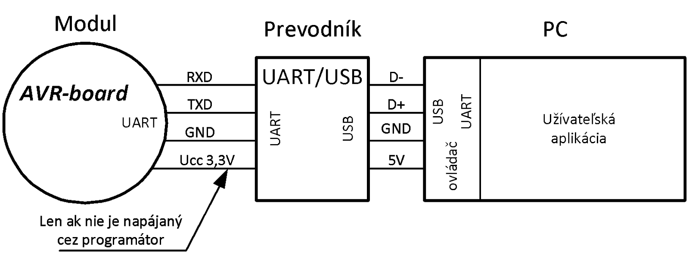
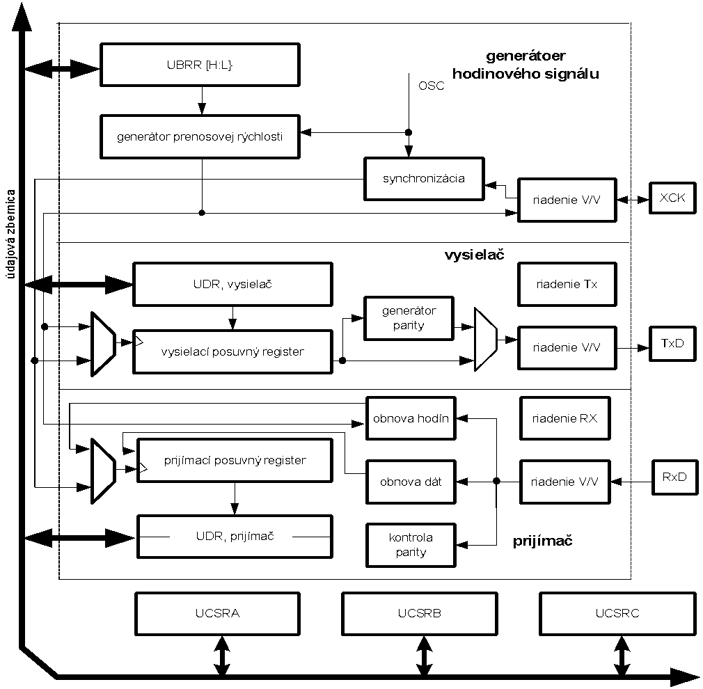

**Projekt AVR1**

Skratka „UART“ je odvodená od počiatočných písmen názvu sériového komunikačného rozhrania „Universal asynchronous receiver-transmitter“. Používa sa na sériový prenos informácií. Prívlastok asynchrónny súvisí so skutočnosťou, že pri prenose informácií nie je potrebné prenášať hodinový/synchronizačný signál. (Či už zakódovaný do dát, alebo po špeciálnom vodiči.) 

Pomocou modulu UART je možné informáciu vysielať a prijímať. Pôvodne bol vyvinutý na prenos informácií medzi dvoma zariadeniami, bod-bod. Dnes sa stretneme aj s rozšírením prenosového systému, ktorý umožňuje aj zbernicové usporiadanie komunikujúcich prvkov. Na obrázku je uvedený typický priebeh signálu pri asynchrónnej komunikácii.


Štart bitom (St) vysielač oznamuje, že ide vyslať rámec s definovaným počtom bitov. Potom nasledujú informačné bity, na obrázku 0 až 8. Za nimi sa vysiela paritný bit (P), za ktorým nasleduje stop bit (Sp1, prípadne Sp2, podľa zvolenej dĺžky). Prijímač potom čaká na nasledujúci štart bit označujúci ďalší rámec. Aby prenos bol úspešný je potrebné aby vysielač a prijímač mali nastavené zhodné parametre prenosu. Medzi tieto parametre patria:

- komunikačná rýchlosť - až do 1 Mb/s (podľa CLKmain)
- počet informačných bitov - 5, 6, 7, 8 alebo 9 bitov,
- parita - párna, nepárna, bez parity
- dĺžka stop bitu - 1 alebo 2 stop bity
- riadenie toku - s riadením, bez riadenia toku

> Nastavenie prenosových parametrov v programe Tera Term
	

Ak chceme komunikovať medzi týmto terminálom a modulom AVR-board je potrebné aby rovnaké parametre boli použité aj v komunikačnom podsystéme USART v obvode ATmega328P. Pripomeňme, že na PC nemáme vyvedenú sériovú linku UART, preto je pri komunikácii potrebný prevodník, ktorý zabezpečí transformáciu linky UART na USB. V počítači sa opätovne programovými prostriedkami príslušného ovládača rozhranie USB transformuje na UART. Vytvorí sa virtuálny COMPORT, na ktorý sa užívateľská aplikácia obracia ako na UART.




Venujme sa však strane mikrontroléra. Ten má vo svojej štruktúre integrovaný komunikačný modul USART, ktorý umožňuje sériovú komunikáciu. 



Synchrónnu (preto je tam to S), ako aj asynchrónnu. Na obrázku je znázornená bloková štruktúra modulu USART. Je pomerne zložitá, preto sa obmedzíme len na popis registrov, do ktorých má prístup užívateľ z programu. Prvý je register UBRR0. Obsah tohto registra definuje prenosovú rýchlosť. Ďalším registrom je register UDR0. Je to register, z ktorého je možné čítať prijatý znak, alebo zapisovať znak, ktorý chcete vyslať.  Fyzicky sú to vlastne dva registre s rovnakou adresou. Nakoniec komunikačný modul USART obsahuje tri riadiace registre UCSRA0, UCSRB0 a UCSRC0 pomocou ktorých nastavuje komunikačné parametre a zisťujeme stav komunikačného modulu. Sú to tzv. stavové a riadiace registre.

Kvôli jednoduchosti sa budeme venovať len asynchrónnej komunikácii. Voľba asynchrónneho režimu sa realizuje zápisom log.0 do bitov UMSEL00 a UMSEL01 v registri UCSR0C. Poznamenajme, že počiatočné nastavenie týchto bitov je 00, preto pokiaľ ich nenastavíme ináč bude modul po zapnutí v režime asynchrónnej komunikácie. Popíšme bližšie význam jednotlivých bitov v dátových, riadiacich a stavových registroch.

## Registre USART komunikačného rozhrania

### Registre prenosovej rýchlosti, UBRR0L a UBRR0H - USART Baud Rate Registers

| Bit     | 15   | 14   | 13   | 12   | 11      | 10      | 9      | 8      |
| ------- | ---- | ---- | ---- | ---- | ------- | ------- | ------ | ------ |
| Symbol  | -    | -    | -    | -    | UBRR011 | UBRR010 | UBRR09 | UBRR08 |
| Prístup | R/W  | R    | R    | R    | R/W     | R/W     | R/W    | R/W    |
| P.hod.  | 0    | 0    | 0    | 0    | 0       | 0       | 0      | 0      |

**UBRR**

**Bity 15:12 – nevyužité (rezervované) bity**

- Pri zápise do UBRR0H musia byť tieto bity rovné nule.


**Bity 11:0 – UBRR011:0: USART Baud Rate Register, register prenosovej rýchlosti**

- 12-bitový register UBRR0 obsahuje údaj o prenosovej rýchlosti jednotky USART. V registri UBRRH sú obsiahnuté štyri najvýznamnejšie bity a register UBRR0L obsahuje osem menej významných bitov. Zmena obsahu registra UBRR0 v priebehu prenosu spôsobí stratu prijímaných a vysielaných dát. Zápisom do registra UBRR0L sa totiž okamžite zmení prenosová rýchlosť.

> Nastavenie prenosovej rýchlosti modulu USART  (U2X=0)
>
> | Pren. 		rýchlosť 		[bps] | UBRR0 		pri 		fosc  4 MHz | UBRR0 		pri 		fosc 8 MHz | UBRR0 		Pri 		fosc 12 MHz | UBRR0 		pri 		fosc 16 MHz |
> | ------------------------------------ | ------------------------------------- | ------------------------------------ | ------------------------------------- | ------------------------------------- |
> | 2400                                 | 103                                   | 207                                  | 312                                   | 416                                   |
> | 4800                                 | 51                                    | 103                                  | 155                                   | 207                                   |
> | 9600                                 | 25                                    | 51                                   | 77                                    | 103                                   |
> | 14.4k                                | 16                                    | 34                                   | 51                                    | 68                                    |
> | 19.2k                                | 12                                    | 25                                   | 38                                    | 51                                    |
> | 28.8k                                | 8                                     | 16                                   | 25                                    | 34                                    |
> | 38.4k                                | 6                                     | 12                                   | 18                                    | 25                                    |
> | 57.6k                                | 3                                     | 8                                    | 12                                    | 16                                    |
> | 76.8k                                | 2                                     | 6                                    | 9                                     | 12                                    |
> | 115.2k                               | 1                                     | 3                                    | 5                                     | 8                                     |
> | 230.4k                               | 0                                     | 1                                    | 2                                     | 3                                     |

---

> **Normálny asynchrónny režim,  U2X0=0**
> $$
> UBRR=\frac{f_{osc}}{16 BAUD}-1
> $$
---
> **Asynchrónny režim s dvojnásobnou rýchlosťou,  U2X0=1**
> $$
> UBRR=\frac{f_{osc}}{8 BAUD}-1
> $$

### V/V údajový register, UDR0 – USART I/O Data Register

| Bit             | 7    | 6    | 5    | 4    | 3    | 2    | 1    | 0    |
| --------------- | ---- | ---- | ---- | ---- | ---- | ---- | ---- | ---- |
| Symbol          | RXB7 | RXB6 | RXB5 | RXB4 | RXB3 | RXB2 | RXB1 | RXB0 |
| Symbol          | TXB7 | TXB6 | TXB5 | TXB4 | TXB3 | TXB2 | TXB1 | TXB0 |
| Prístup         | R/W  | R/W  | R/W  | R/W  | R/W  | R/W  | R/W  | R/W  |
| p. 		hod. | 0    | 0    | 0    | 0    | 0    | 0    | 0    | 0    |

**UDR**

### Riadiaci a stavový register A, UCSR0A - USART Control and Status Register A 

| Bit     | 7    | 6    | 5     | 4    | 3    | 2    | 1    | 0     |
| ------- | ---- | ---- | ----- | ---- | ---- | ---- | ---- | ----- |
| Symbol  | RXC0 | TXC0 | UDRE0 | FE0  | DOR0 | UPE0 | U2X0 | MPCM0 |
| Prístup | R    | R/W  | R     | R    | R    | R    | R/W  | R/W   |
| P.hod.  | 0    | 0    | 1     | 0    | 0    | 0    | 0    | 0     |

**UCSRA**

**Bit 7 – RXC0: USART Recieve Complete, príjem znaku ukončený**

- Tento príznakový bit je nastavený na hodnotu 1, ak v prijímací zásobník obsahuje neprečítané dáta. Bit RXC0 je vynulovaný, ak prijímací zásobník je prázdny. Ak sa zakáže činnosť prijímača, potom sa vynuluje zásobník a bit RXC0 bude obsahovať hodnotu 0. Príznakový bit RXC môže byť využitý na generovanie prerušenia.

**Bit 6 – TXC0: USART Transmit Complete, ukončené vysielanie znaku**

- Tento príznakový bit sa nastaví na hodnotu 1 vtedy, keď rámec vložený do vysielacieho posuvného registra je kompletne vyslaný a nové údaje nie sú zapísané do vysielacieho vyrovnávacieho registra (UDR0). TXC0 príznak sa automaticky vynuluje, keď sa vykoná príslušná obsluha prerušenia, alebo zápisom 1 do tejto V/V lokácie.  Príznak TXC0 môže byť využitý na generovanie žiadosti o prerušenie.

**Bit 5 – UDRE0: USART Data Register Empty, údajový register prázdny**

- Príznakový bit UDRE0 indikuje, že vysielací vyrovnávací register je pripravený prijať nové dáta. Ak bit UDRE0 má hodnotu 1, potom vyrovnávací register je prázdny a pripravený na zápis nového znaku. Príznak UDRE0 môže byť využitý na generovanie žiadosti o prerušenie.

**Bit 4 – FE0: Frame Error, chyba rámca**

- Tento bit sa nastaví na hodnotu 1, ak znak v prijímacom vyrovnávacom registri obsahoval chybu rámca (prvý stop bit prijatého znaku bol rovný log.0). Hodnota bitu FE0 je platná pokiaľ sa neprečíta obsah prijímacieho vyrovnávacieho registra UDR0. Bit FE0 je rovný nule, ak stop bit prijatého rámca má hodnotu jedna. Zápisom do registra UCSR0A sa uvedený bit vynuluje.


**Bit 3 – DOR0: Data OverRun, pretečenie dát**

- Tento bit sa nastaví na hodnotu 1, ak dôjde k pretečeniu pri príjme dát. Pretečenie vynikne vtedy, ak prijímací zásobník je plný-(dva znaky), nový znak je v prijímacom posuvnom registri a prijatý je ďalší štart bit. Hodnota bitu DOR0 je platná pokiaľ sa neprečíta obsah prijímacieho vyrovnávacieho registra UDR0. Zápisom do registra UCSR0A sa uvedený bit vynuluje.


**Bit 2 – UPE0: Parity Error, chyba parity**

- Bit UPE0 sa nastaví na hodnotu 1, ak znak v prijímacom vyrovnávacom registri obsahoval chybu parity, pričom kontrola parity bola povolená (UPM01=1). Hodnota bitu UPE0 je platná, pokiaľ sa neprečíta obsah prijímacieho vyrovnávacieho registra UDR0. Zápisom do registra UCSR0A sa uvedený bit vynuluje.

**Bit 1 – U2X0: Double the USART Transmission Speed, dvojnásobná prenosová rýchlosť**

- Bit U2X0 má význam len pri asynchrónnom prenose. Ak je zvolený synchrónny prenos, do bitu U2X0 sa zapíše hodnota 0. Pri asynchrónnej komunikácii sa zápisom jednotky do bitu U2X0 prenosová rýchlosť zdvojnásobí.


**Bit 0 – MPCM0: Multi-processor Communication Mode**

- Pomocou bitu MPCM0 sa povoľuje režim multiprocesorovej komunikácie. Keď bit MPCM0 obsahuje1, potom všetky prijímané rámce, ktoré neobsahujú informáciu o adrese sa prijímačom USART ignorujú. Poznamenajme, že hodnota bitu MPCM nemá vplyv na činnosť vysielača modulu USART.

### Riadiaci a stavový register B, UCSR0B- USART Control and Status Register B

| Bit                  | 7      | 6      | 5      | 4     | 3     | 2      | 1     | 0     |
| -------------------- | ------ | ------ | ------ | ----- | ----- | ------ | ----- | ----- |
| Symbol               | RXCIE0 | TXCIE0 | UDREI0 | RXEN0 | TXEN0 | UCSZ02 | RXB80 | TXB80 |
| Prístup              | R/W    | R/W    | R/W    | R/W   | R/W   | R/W    | R     | R/W   |
| Poč. 		hodnota | 0      | 0      | 0      | 0     | 0     | 0      | 0     | 0     |

**UCSRB**

**Bit 7– RXCIE0: RX Complete Interrupt Enable, povolenie prerušenia od RXC**

- Zápisom 1 do bitu RXCIE0 sa povoľuje prerušenie od príznaku RXC. Prerušenie RXC bude generované vtedy, keď bit RXCIE0 obsahuje hodnotu log.1, je globálne povolená obsluha prerušení (bit I v SREG má hodnotu log.1) a súčasne sa bit RXC0 v registri UCSR0A nastaví na hodnotu 1.


**Bit 6 – TXCIE0: TX Complete Interrupt Enable, povolenie prerušenia od TXC**

- Zápisom 1 do bitu TXCIE0 sa povoľuje prerušenie od príznaku TXC0. Prerušenie TXC0 bude generované vtedy, keď bit TXCIE0 obsahuje hodnotu log.1, je globálne povolená obsluha prerušení (bit I v SREG má hodnotu log.1) a súčasne sa bit TXC0 v registri UCSR0A nastaví na hodnotu 1.


**Bit 5 – UDRIE0: USART Data Register Empty Interrupt Enable, povolenie prerušenia od UDRE0**

- Zápisom 1 do bitu UDRIE0 sa povolí prerušenie od príznaku UDRE0. Prerušenie UDRE0 bude generované, ak bit UDRIE0 obsahuje hodnotu 1, je globálne povolená obsluha prerušení (bit I v SREG má hodnotu log.1) a súčasne sa bit UDRE0 v registri UCSR0A nastaví na hodnotu 1.


**Bit 4 – RXEN0: Receiver Enable, povolenie činnosti prijímača**

- Zápisom 1 do bitu RXEN0 sa povolí činnosť prijímača jednotky USART. Režim V/V vývodu RxD sa nastaví na vstup do prijímača USART. Ak sa zakáže činnosť prijímača (RXEN0 = 0 ), potom sa zničí obsah prijímacieho zásobníka a príznakov FE0, DOR0 a PE0.


**Bit 3 – TXEN0: Transmitter Enable, povolenie činnosti vysielača**

- Zápisom do bitu TXEN0 sa povoľuje činnosť vysielača jednotky USART. Aktuálny režim V/V vývodu TxD sa nastaví na výstup z vysielača USART. Ak sa zakáže činnosť prijímača (TXEN0 = 0 ), potom sa vyšlú všetky údaje z posuvného vysielacieho registra a z vyrovnávacieho registra, zakáže sa činnosť vysielača a vývod TxD sa vráti do pôvodného režimu.


**Bit 2 – UCSZ02: Character Size, dĺžka znaku**

- Bit UCSZ02 spolu s bitmi UCSZ01:0 v registri UCSR0C určuje počet údajových bitov prenášaného znaku.


**Bit 1 – RXB80: Receive Data Bit 8, prijatý údajový bit 8**

- Ak je nastavená dĺžka prenášaných znakov na deväť bitov, potom v bite RXB80 je uchovaná hodnota prijatého deviateho údajového bitu RXB80. Jeho hodnota musí byť prečítaná pred čítaním obsahu registra UDR0.


**Bit 0 – TXB80: Transmit Data Bit 8, vysielaný údajový bit 8**

- Ak je nastavená dĺžka prenášaných znakov na deväť bitov, potom TXB80 reprezentuje deviaty vysielaný údajový bit. Deviaty údajový bit musí byť zapísaný pred zápisom spodných ôsmych bitov do registra UDR0.

### Riadiaci a stavový register C, UCSR0C - USART Control and Status  Register C

| Bit     | 7       | 6       | 5     | 4     | 3     | 2      | 1      | 0      |
| ------- | ------- | ------- | ----- | ----- | ----- | ------ | ------ | ------ |
| Symbol  | UMSEL01 | UMSEL00 | UPM01 | UPM00 | USBS0 | UCSZ01 | UCSZ00 | UCPOL0 |
| Prístup | R/W     | R/W     | R/W   | R/W   | R/W   | R/W    | R/W    | R/W    |
| P.hod.  | 1       | 0       | 0     | 0     | 0     | 1      | 1      | 0      |

**UCSR0C**

**Bit 7 – URSEL00,1: Register Select, volba rezimu USART, SPI**

- Na základe hodnoty bitov URSEL je možné voliť režim činnosti USART. (Asynchrónny USART, synchrónny USART, SPI)

**Bit 6 – UMSEL0: USART Mode Select, výber režimu USART**

- Pomocou bitu UMSEL0 sa volí režim činnosti jednotky USART. Ak bit UMSEL0 má hodnotu nula, potom USART pracuje v asynchrónnom prenosovom režime. Ak bit UMSEL0 má hodnotu jedna, potom USART pracuje v synchrónnom prenosovom režime.

**Bit 5:4 – UPM01:0: Parity Mode, režim parity**

- Tieto bity povoľujú a nastavujú typ generovania a kontroly parity. Ak je generovanie a kontrola parity povolená, potom vysielač bude v každom rámci generovať a vysielať paritný bit. Prijímač bude na základe prichádzajúcich dát generovať hodnotu paritného bitu a porovnávať ho s prichádzajúcim paritným bitom v súlade s nastavením bitu UPM00. Pri chybe parity sa nastaví príznak PE0 v registri UCSR0A.

> *Nastavenie režimu generovania a kontroly parity* 
>
> | UPM01 | UPM00 | Režim 		parity             |
> | ----- | ----- | -------------------------------- |
> | 0     | 0     | Zakázaná                         |
> | 0     | 1     | Nevyužité                        |
> | 1     | 0     | Povolená, 		párna parita   |
> | 1     | 1     | Povolená, 		nepárna parita |

**Bit 3 – USBS0: Stop Bit Select, výber stop bitu**

- Pomocou bitu USBS0 sa volí počet stop bitov, ktoré sú vložené do vysielaného rámca. Ak bit USBS0 má hodnotu nula, potom vysielaný rámec obsahuje jeden stop bit. Ak bit USBS0 má hodnotu jedna, potom vysielaný rámec bude obsahovať dva stop bity. Prijímač modulu USART ignoruje nastavenie bitu USBS0.


**Bit 2:1 – UCSZ01:0: Character Size, dĺžka znaku**

- Pomocou bitov UCSZ01:0 a bitu UCSZ02 v registri UCSR0B je možné nastaviť počet dátových bitov (dĺžku znaku) vo vysielanom a prijímanom rámci.

> *Nastavenie dĺžky vysielaného znaku*
>
> | UCSZ02 | UCSZ01 | UCSZ00 | Dĺžka 		znaku |
> | ------ | ------ | ------ | ------------------- |
> | 0      | 0      | 0      | 5 		bitov     |
> | 0      | 0      | 1      | 6 		bitov     |
> | 0      | 1      | 0      | 7 		bitov     |
> | 0      | 1      | 1      | 8 		bitov     |
> | 1      | 0      | 0      | Nevyužité           |
> | 1      | 0      | 1      | Nevyužité           |
> | 1      | 1      | 0      | Nevyužité           |
> | 1      | 1      | 1      | 9 		bitov     |

**Bit 0 – UCPOL0: Clock Polarity, polarita hodinových impulzov**

- Bit UCPOL0 je využitý len v prípade synchrónneho prenosového režimu. Ak je používaný asynchrónny režim do bitu UCPOL zapisujeme nulu. Pomocou bitu UCPOL0 definujeme vzťah medzi hodinovým signálom a vzorkovaním vstupného signálu, respektíve okamžikom zmeny výstupného signálu podľa tabuľky. 

> *Nastavenie bitu UCPOL*
>
> | UCPOL0 | Zmena 		vysielaných dát,(TxD vývod) | Vzorkovanie 		prijímaných dát, (RxD vývod) |
> | ------ | ----------------------------------------- | ------------------------------------------------ |
> | 0      | Vzostupná 		XCK hrana               | Zostupná 		XCK hrana                       |
> | 1      | Zostupná 		XCK hrana                | Vzostupná 		XCK hrana                      |

Je samozrejme možné programovať aj bez týchto detailných znalostí obvodu USART. Ak využijete knižnice, ktoré ponúka IDP AtmelStudio, prípadne Arduino, budete využívať kódy, ktoré už pred vami niekto naprogramoval. Potom sa stačí oboznámiť s dostupnými funkciami knižničných programov a využívať ich vo vlastných aplikáciách. Samozrejme, tento postup predstavuje časovo efektívnejší spôsob vývoja aplikácií, má však isté obmedzenia. Ak chcete tvoriť vlastné funkcie optimalizované pre konkrétne použitie, prípadne pre špecializovaný hardvér, musíte siahnuť až na túto najnižšiu úroveň programovania. 

## Úloha

Vráťme sa však konečne k nášmu projektu UART. V prvom kroku vytvoríme triedu s názvom UART, ktorá bude obsahovať len tri metódy:

- inicializácia `UART_init()`,
- vyslanie znaku `UART_vysli_znak(char)`,
- príjem znaku  `UART_citaj_znak(void)`.

> Štruktúra projektu
>
> ``` bash
>     .
>     ├── AKUC.cpp
>     ├── AKUC.h
>     ├── BOARD_AVR.h
>     ├── main.cpp
>     ├── RGB_LED.cpp
>     ├── RGB_LED.h
>     ├── TLACIDLO.cpp
>     ├── TLACIDLO.h
>     ├── UART_BT.cpp #nová trieda
>     └── UART_BT.h # nový hlavičkový súbor
> ```

=== "Hlavičkový súbor UART.h"
    ``` c++
    #ifndef __UART_H__
    #define __UART_H__
    
    #include "BOARD_AVR.h"
    
    class UART
    {
        //variables
    public:
    protected:
    private:
        //functions
    public:
        UART();
        ~UART();
        void Uart_init(void);			// nastavenie parametrov prenosu
        void Uart_send_char(uint8_t x); //vyslanie znaku
        uint8_t Uart_rec_char(void);	//prijem znaku
    
    protected:
    private:
    };	   //UART
    #endif //__UART_H__
    ```
=== "Definičný súbor UART.cpp"
    ``` c++
    #include "UART.h"

    // default constructor
    UART::UART()
    {
        PRR &= ~(1 << PRUSART0);
    } //UART
    
    // default destructor
    UART::~UART()
    {
        PRR |= (1 << PRUSART0);
    }
    
    void UART::Uart_init(void)
    {
        DDRD |= (1 << TXD);					 // Tx output
        DDRD &= ~(1 << RXD);				 //Rx input
        UBRR0H = (uint8_t)(UBRR_VALUE >> 8); // BAUDERATE  v BOARD_AVR.h
        UBRR0L = (uint8_t)UBRR_VALUE;
        UCSR0C |= (1 << UCSZ01) | (1 << UCSZ00); //8 bits, parit non, 1 stop
        UCSR0B |= (1 << RXEN0) | (1 << TXEN0);	 // enable rx a tx
        UCSR0A |= (1 << U2X0);
    };
    
    void UART::Uart_send_char(uint8_t x)
    {
        while (!(UCSR0A & (1 << UDRE0)))
        {
        }; // caka na uvolnenie UDR
        UDR0 = x;
    };
    
    uint8_t UART::Uart_rec_char(void)
    {
        while (!(UCSR0A & (1 << RXC0)))
        {
        }; // caka na prijem znaku
        return UDR0;
    };
    ```

**Pre overenie funkcií triedy UART uvádzame aj jednoduchý kód funkcie `main()`:**

=== "main.cpp"
    ``` c++
    RGB_LED led; // vytvorenie instancie led triedy RGB_LED
    AKUC aku;
    TLACIDLO tl;		  // tl je meno objektu
    TLACIDLO *p_tl = &tl; //p_tl je pointer na objekt tl
    UART uart;

	int main(){
		uart.Uart_init();
		char pocet = 0;
	    
	    for (uint8_t i = 0; i < 20; i++){
	        uart.Uart_send_char('-');
	    }
	    uart.Uart_send_char('\n');
	    uart.Uart_send_char('\r');
	
	    while (1) //nekonecny cyklus
	    {
	        //while(!p_tl->get_Tlac()){};   // pokial nie je stlacene caka
	        char znak = uart.Uart_rec_char(); //caka na prijem znaku
	        //uart.Uart_send_char(pocet+0x30);
	        uart.Uart_send_char(znak);
	        pocet++;
	    }
	}
	```


Všimnime si funkciu `UART_init()`. Táto nastavuje všetky parametre sériového prenosu. Nebolo by vhodnejšie aby pri volaní funkcie užívateľ zadal konkrétne parametre prenosu podľa aktuálnej potreby? Samozrejme, že áno. Preto sa pokúste upraviť túto funkciu tak, aby sme pri jej volaní mohli zadať aspoň prenosovú rýchlosť.


## Rozšírenie triedy UART 

**Projekt AVR1**

Predchádzajúcu triedu `UART` mierne modifikujeme, tak aby ju bolo možné využívať na vysielanie reťazcov znakov, znamienkových a neznamienkových čísel `int` a `long int`. Trieda je nazvaná `UART_BT`. V ďalších príkladoch ju budeme častejšie používať na komunikáciu medzi AVR-Board a PC. Upozorňujeme na skutočnosť že metóda `Uart_send(x)` môže byť volaná s rôznymi typmi argumentu „x“. Na základe typu argumentu sa volá odpovedajúca metóda/funkcia (jedna z piatich). Tomuto javu sa hovorí preťaženie funkcií.

=== "Hlavičkový súbor UART_BT.h"
    ``` c++
    #ifndef __UART_BT_H__
    #define __UART_BT_H__
    #include "BOARD_AVR.h"
    
    class UART_BT
    {
        //variables
    public:
    protected:
    private:
        //functions
    public:
        UART_BT();
        ~UART_BT();
        void Uart_int(void);
    
        void Uart_send_char(uint8_t x);
        uint8_t Uart_rec_char(void);
    
        void Uart_send_bytes(char *data, const uint8_t len);
        void Uart_send(const char *data);
        void Uart_send(long num);
        void Uart_send(unsigned long num);
        void Uart_send(int num);
        void Uart_send(unsigned int num);
    
    protected:
    private:
    }; //UART_BT
    
    #endif //__UART_BT_H__
    ```
=== "Definičný súbor UART_BT.cpp"
    ``` c++
    #include "UART_BT.h"
    
    UART_BT::UART_BT()
    { // Konstruktor
        PRR &= ~(1 << PRUSART0);
    };
    
    UART_BT::~UART_BT()
    { // Destruktor
        PRR |= (1 << PRUSART0);
    };
    
    void UART_BT::Uart_int(void)
    {
        DDRD |= (1 << PORTD1);				 // Tx output
        DDRD &= ~(1 << PORTD0);				 // Rx input
        UBRR0H = (uint8_t)(UBRR_VALUE >> 8); // BAUDERATE  v BOARD_AVR.h
        UBRR0L = (uint8_t)UBRR_VALUE;
        UCSR0C |= (1 << UCSZ01) | (1 << UCSZ00); //8 bits, parit non, 1 stop
        UCSR0B |= (1 << RXEN0) | (1 << TXEN0);	 // enable rx a tx
        UCSR0A |= (1 << U2X0);
    };
    
    void UART_BT::Uart_send_char(uint8_t x)
    {
        while (!(UCSR0A & (1 << UDRE0)))
        {
        }; // caka na uvolnenie UDR
        UDR0 = x;
    };
    
    uint8_t UART_BT::Uart_rec_char(void)
    {
        while (!(UCSR0A & (1 << RXC0)))
        {
        }; 
        return UDR0;
    };
    
    void UART_BT::Uart_send_bytes(char *data, const uint8_t len)
    {
        for (uint8_t i = 0; i < len; i++)
            this->Uart_send_char(*(data++));
    };
    
    void UART_BT::Uart_send(const char *data)
    {
        for (const char *s = data; *s; ++s)
        {
            this->Uart_send_char(*s);
        }
    };
    
    void UART_BT::Uart_send(long num)
    {
        if (num < 0)
        {
            this->Uart_send_char('-');
            num = -num;
        }
        this->Uart_send((unsigned long)num);
    };
    
    void UART_BT::Uart_send(unsigned long num)
    {
        // max počet signed/unsigned long je 10
        char digits[10];
        uint8_t len = 0;
        do
        {
            digits[len] = '0' + (num % 10);
            len++;
        } while (num /= 10);
        while (len > 0)
        {
            this->Uart_send_char(digits[--len]);
        }
    };
    
    void UART_BT::Uart_send(int num)
    {
        this->Uart_send((long)num);
    };
    
    void UART_BT::Uart_send(unsigned int num)
    {
        this->Uart_send((unsigned long)num);
    };
    ```
---

=== "main.cpp "
    ``` c++
    #include "BOARD_AVR.h"
    #include "UART_BT.h"

        int
        main(void)
    {
    
        UART_BT ua;			//objekt pomenovaný ua
        UART_BT *p_U = &ua; //pointer na objekt ua
    
        ua.Uart_int(); 		//inicializácia Vlastnosti: 8N1, rýchlosť 9600
    
        ua.Uart_send("TOTO je test vysielania AVR_BOARD\n\r");
    
        while (1)
        {
        };
    }
    ```
