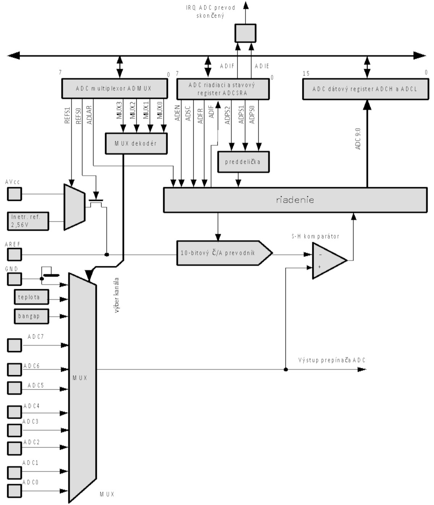

**Projekt AVR2_0**

Súčasťou dosky AVR_Board je súčiastka, ktorú nazývame fotoodpor. Fotoodpor je prvok, ktorý v závislosti od intenzity osvetlenia mení svoj odpor. Na doske AVR_Board je osadený fotoodpor GYxxxx podľa obrázka.


Zo zapojenia je zrejmé, že fotoodpor a odpor R7 vytvárajú napäťový delič, pričom hodnota napätia Uf, na vstupe AD6 je rovná: 
$$
U_f=\frac{R_{FOTO}}{R7+R_{FOTO}}U_A
$$
Vidíme, že veľkosť napätia $U_f$ závisí od hodnoty $R_{FOTO}$ a odporu $R7$ a napätia $U_A$, ktoré sú konštantné. Jediná premenlivá veličina v predchádzajúcom vzťahu je odpor $R_{FOTO}$. Poznamenajme, že so vzrastajúcou intenzitou osvetlenia odpor fotoodporu klesá. Tento jav spôsobuje pokles napätia $U_f$. Presvedčme sa o tom pomocou nasledujúcej úlohy.

Vytvorte aplikáciu, ktorá každú sekundu odmeria napätie $U_f$ na vstupe AD6 analógovo číslicového prevodníka (ADC) a získanú hodnotu vyšle prostredníctvom triedy `UART` na obrazovku PC.

V rámci projektu využijeme už vytvorené súbory:

`BOARD_AVR.h, UART_BT.h, UART_BT.cpp`

Na úspešné riešenie úlohy je vhodné vytvoriť triedu `ADC1` (súbory ADC1.h a ADC1.cpp) umožňujúcu využívať analógovo číslicový prevodník. Túto triedu využijeme aj pri niektorých ďalších úlohách.

Pred tým, než vytvoríme triedu `ADC1`, uveďme zopár informácií o analógovo-číslicovom prevodníku. Predpokladáme, že jeho základnú funkciu poznáte – má realizovať transformáciu spojitého signálu na diskrétny ekvivalent. To znamená, že spojitý signál v čase i v úrovni nahradí postupnosťou čísel.

## Analógovo-číslicový prevodník

- 10 bitové rozlíšenie,
- integrálna nelinearita 0.5 LSB,
- absolútna presnosť ±2 LSB,
- čas prevodu 13μs až 260μs, 
- 6, alebo 8 prepínateľných vstupných kanálov,
- vstupný rozsah 0 až Vcc,
- voliteľné referenčné napätie 1.1 V,
- teplotný senzor,
- opakovací režim prevodu, alebo jednorazový prevod,
- štart prevodu pri rôznych prerušeniach,
- prerušenie pri skončení prevodu,
- režim redukcie šumu.



## Registre A/D prevodníka

###ADMUX: Register multiplexora

| Bit             | 7         | 6         | 5         | 4     | 3        | 2        | 1        | 0        |
| --------------- | --------- | --------- | --------- | ----- | -------- | -------- | -------- | -------- |
| Symbol          | **REFS1** | **REFS0** | **ADLAR** | **-** | **MUX3** | **MUX2** | **MUX1** | **MUX0** |
| Prístup         | R/W       | R/W       | R/W       | R     | R/W      | R/W      | R/W      | R/W      |
| P. 		hod. | 0         | 0         | 0         | 0     | 0        | 0        | 0        | 0        |

**Bit 7:6  - REFS1:0:** Výber zdroja referenčného napäti

| **REFS1** | **REFS0** | **Zdroj 		referenčného napätia**                       |
| --------- | --------- | ------------------------------------------------------------ |
| 0         | 0         | Interná 		referencia je vypnutá, externé referenčné napätie je 		privedené na vývod AREF |
| 0         | 1         | AVcc                                                         |
| 1         | 0         | Rezervované                                                  |
| 1         | 1         | Interná 		referencia 1.1V                              |

**Bit 5  - ADLAR:** Umiestnenie výsledku v registroch ADCH a ADCL. Ak hodnota bitu ADLAR je log. jednotka, potom výsledok bude umiestnený tak, že horných 8 bitov bude v registri ADCH a 2 spodné bity v registri ADCL, v  bitoch 7 a 6. V opačnom prípade bude spodných 8 bitov výsledku v registri ADCL a dva najvyššie bity v registri ADCL, v bitoch 1 a 0. 

**Bity 4:0 – MUX4:0**: Výber kanála a voľba zosilnenia. Ak sa zmení hodnota týchto bitov počas prevodu, táto zmena sa prejaví až pri nasledujúcom prevode. 

| **MUX3:0** | **Jednoduchý 		vstup**                              |
| ---------- | --------------------------------------------------------- |
| 0000       | ADC0                                                      |
| 0001       | ADC1                                                      |
| 0010       | ADC2                                                      |
| 0011       | ADC3                                                      |
| 0100       | ADC4                                                      |
| 0101       | ADC5                                                      |
| 0110       | ADC6                                                      |
| 0111       | ADC7                                                      |
| 1000       | <div class="w3-container w3-green" >Teplotný senzor</div> |
| 1001       | Reserv.                                                   |
| 1010       | Reserv.                                                   |
| 1011       | Reserv.                                                   |
| 1100       | Reserv.                                                   |
| 1101       | Reserv.                                                   |
| 1110       | 1.1V                                                      |
| 1111       | GND                                                       |

### ADCSRA: Riadiaci a stavový register A/Č prevodníka

**Bit 7  - ADEN:** Povolenie činnosti prevodníka. Zápisom log.1 do bitu ADEN sa povoľuje činnosť prevodníka.

**Bit 6  - ADCS:** Štart prevodu. Ak prevodník pracuje v jednorazovom režime, potom pred každým prevodom musí byť do bitu ADCS zapísaná hodnota log.1. Po skončení prevodu sa bit ADCS vynuluje.

**Bit 5  - ADATE:** Povolenie automatického štartu. Ak hodnota bitu ADATE je log.1, potom sa prevod začne na nábežnú hranu vybraného štartovacieho signálu. Výber zdroja štartovacieho signálu sa realizuje vhodným nastavením bitov ADTS v registri špeciálnych funkcií SFIOR. 

**Bit 4  - ADIF:** Príznak prerušenia. Tento bit sa nastaví na hodnotu log.1 pri skončení prevodu. Bit ADIF sa automaticky vynuluje po výkone obsluhy zodpovedajúceho prerušenia. Alternatívne, môže byť bit ADIF vynulovaný zápisom log.1.

**Bit 3  - ADIE:** Povolenie prerušenia pri skončení prevodu. Ak bit ADIE je nastavený na log.1 a I-bit v S-registri je tiež nastavený bude povolené prerušenie pri skončení prevodu.

**Bit 2:0  - ADPS2:0:** Nastavenie deliaceho pomeru medzi hodinovou frekvenciou (XTAL) a frekvenciou hodinových impulzov do ADC podľa tabuľky.

| ADSP2 | ADSP1 | ADSP1 | Deliaci 		pomer |
| ----- | ----- | ----- | --------------------- |
| 0     | 0     | 0     | 2                     |
| 0     | 0     | 1     | 2                     |
| 0     | 1     | 0     | 4                     |
| 0     | 1     | 1     | 8                     |
| 1     | 0     | 0     | 16                    |
| 1     | 0     | 1     | 32                    |
| 1     | 1     | 0     | 64                    |
| 1     | 1     | 1     | 128                   |

###Dátové registre A/Č prevodníka

| Bit             | 7     | 6     | 5     | 4     | 3     | 2     | 1        | 0        |
| --------------- | ----- | ----- | ----- | ----- | ----- | ----- | -------- | -------- |
| Symbol          | **-** | **-** | **-** | **-** | **-** | **-** | **ADC9** | **ADC8** |
| Prístup         | R     | R     | R     | R     | R     | R     | R        | R        |
| P. 		hod. | 0     | 0     | 0     | 0     | 0     | 0     | 0        | 0        |

**ADCH, (ADLAR=0)**

| Bit             | 7        | 6        | 5        | 4        | 3        | 2        | 1        | 0        |
| --------------- | -------- | -------- | -------- | -------- | -------- | -------- | -------- | -------- |
| Symbol          | **ADC7** | **ADC6** | **ADC5** | **ADC4** | **ADC3** | **ADC2** | **ADC1** | **ADC0** |
| Prístup         | R        | R        | R        | R        | R        | R        | R        | R        |
| P. 		hod. | 0        | 0        | 0        | 0        | 0        | 0        | 0        | 0        |

**ADCL, (ADLAR=0)**

| Bit             | 7        | 6        | 5        | 4        | 3        | 2        | 1        | 0        |
| --------------- | -------- | -------- | -------- | -------- | -------- | -------- | -------- | -------- |
| Symbol          | **ADC9** | **ADC8** | **ADC7** | **ADC6** | **ADC5** | **ADC4** | **ADC3** | **ADC2** |
| Prístup         | R        | R        | R        | R        | R        | R        | R        | R        |
| P. 		hod. | 0        | 0        | 0        | 0        | 0        | 0        | 0        | 0        |

 **ADCH, (ADLAR=1)**

| Bit             | 7        | 6        | 5     | 4     | 3     | 2     | 1     | 0     |
| --------------- | -------- | -------- | ----- | ----- | ----- | ----- | ----- | ----- |
| Symbol          | **ADC1** | **ADC0** | **-** | **-** | **-** | **-** | **-** | **-** |
| Prístup         | R        | R        | R     | R     | R     | R     | R     | R     |
| P. 		hod. | 0        | 0        | 0     | 0     | 0     | 0     | 0     | 0     |

 **ADCL, (ADLAR=1)**

!!! note "Poznámka"
	Pripomíname, že po skončení prevodu sa výsledok nachádza v týchto registroch. V opakovacom režime je potrebné priebežne zaistiť čítanie týchto registrov. Register ADCL sa číta skôr než register ADCH.

Popíšeme ešte register špeciálnych funkcií, pretože jeho tri bity sa využívajú na definovanie štartu A/Č prevodu.

###ADCSRB riadiaci a stavový register B

| Bit             | 7     | 6    | 5     | 4     | 3     | 2     | 1     | 0     |
| --------------- | ----- | ---- | ----- | ----- | ----- | ----- | ----- | ----- |
| Symbol          | **-** | ACME | **-** | **-** | **-** | ADTS2 | ADTS1 | ADTS0 |
| Prístup         | R     | R/W  | R     | R     | R     | R/W   | R/W   | R/W   |
| P. 		hod. | 0     | 0    | 0     | 0     | 0     | 0     | 0     | 0     |

**ADCSRB**

**Bit 6 – ACME** 1 – (pri ADEN 0) výstup multiplexora je privedený na vstup analógového komparátora. 

**Bit 7:5  - ADTS2:0:** V prípade, že je povolená činnosť prevodníka a bit ADATE v registri ADCSRA je nastavený na hodnotu log.1, potom uvedené tri bity definujú štartovanie A/Č prevodu podľa tabuľky.

| **ADTS2** | **ADTS1** | **ADTS0** | **Zdroj 		spúšťania A/Č prevodu**                      |
| --------- | --------- | --------- | ------------------------------------------------------------ |
| 0         | 0         | 0         | Opakovací 		režim                                      |
| 0         | 0         | 1         | Analógový 		komparátor                                 |
| 0         | 1         | 0         | Externé 		prerušenie 0                                 |
| 0         | 1         | 1         | Čítač/časovač0, 		zhoda obsahu s porovnávacím registrom A |
| 1         | 0         | 0         | Čítač/časovač0, 		pretečenie                           |
| 1         | 0         | 1         | Čítač/časovač1, 		zhoda obsahu s registrom B           |
| 1         | 1         | 0         | Čítač/časovač1, 		pretečenie                           |
| 1         | 1         | 1         | Čítač/časovač1, 		záchytná udalosť                     |

**DIDR0 register pre zákaz digitálnych vstupov**

| Bit             | 7     | 6    | 5         | 4         | 3         | 2         | 1         | 0         |
| --------------- | ----- | ---- | --------- | --------- | --------- | --------- | --------- | --------- |
| Symbol          | **-** | -    | **ADC5D** | **ADC4D** | **ADC3D** | **ADC2D** | **ADC1D** | **ADC0D** |
| Prístup         | R     | R/W  | R         | R         | R         | R/W       | R/W       | R/W       |
| P. 		hod. | 0     | 0    | 0         | 0         | 0         | 0         | 0         | 0         |

Zápisom log.1 sa zakazuje činnosť vstupného vyrovnávacieho registra. Pri čítaní hodnoty na vývode PINx sa teraz prečíta hodnota log.0. Zápisom logickej jednotky do príslušného bitu registra DIDR0 sa redukuje spotreba vstupného registra.

## Implementácia triedy ADC1

=== "ADC1.h"
	``` c++
	#ifndef __ADC_H__
    #define __ADC_H__
    #include "BOARD_AVR.h"

    class ADC1
    {
        //variables
    public:
    protected:
    private:
        //functions
    public:
        ADC1();
        ~ADC1();
    
        void Init_ADC(uint8_t clock, bool mode); // clk 000 2, 001 2, 010  4,  8,  			//16, 32, 64, 128    opakovany rezim: true; jednorazov: false
        void Set_CHANNEL(uint8_t);               // vyber kanal 0-7
        void Set_REF(uint8_t);                   // vyber referencne napatie
        int Get_ADC(void);                       // vrat vysledok prevodu 10-bitov
        uint8_t Get_ADC8(void);                  // vrat vysledok prevodu 8-bitov
    
    protected:
    private:
    }; //ADC
    
    #endif //__ADC_H__
    ```
=== "ADC1.cpp"
	``` c++
    #include "ADC.h"

    ADC1::ADC1()
    {
        PRR &= ~(1 << PRADC); //enable ADC
    } //ADC_Solar
    
    // default destructor
    ADC1::~ADC1()
    {
        PRR |= (1 << PRADC); //disable ADC
    } //~ADC_Solar
    void ADC1::Init_ADC(uint8_t hod, bool rezim)
    {                              //false progr.start
        hod = hod & 0x7;           //
        ADCSRA = 0b10000000 | hod; //  ADEN, ADSC, ADATE, ADIF, ADIE,ADPS2,1,0
        if (rezim)
            ADCSRA |= 0x20; // ADATE: autotriger;
    }
    
    void ADC1::Set_CHANNEL(uint8_t kanal)
    { //kanal 0- F
        kanal &= 0x0F;
        ADMUX &= 0xF0;
        ADMUX |= kanal;             //AVCC  010... 10bit  0110... 8bit - ADLAR=1
    };                              //REFS0, REFS1, ADLAR, RES, MUX....
    void ADC1::Set_REF(uint8_t ref) //REFS0; REFS1;: 0..00 ext ref, 1..01 AVcc, 2..10 res, //3..11 intref 1.1V
    {
        ref = ref & 0b00000011; //mask
        ADMUX &= 0b00111111;
        ADMUX |= (ref << 6);
    };
    
    int ADC1::Get_ADC(void)
    {
        ADMUX &= ~(1 << ADLAR); // ADLAR=0   0b11011111;
        ADCSRA |= (1 << ADSC);  // start
        while ((ADCSRA & (1 << ADIF)) != (1 << ADIF))
        {
        }; //caka na koniec prevodu
        int prev = ADCL;
        prev |= ADCH << 8;
        ADCSRA |= (1 << ADIF); //alternativa k vynulovaniu ADIF
        return prev;
    };
    
    uint8_t ADC1::Get_ADC8(void)
    {
        ADMUX |= (1 << ADLAR); //ADLAR=1
        ADCSRA |= (1 << ADSC); // start
        while ((ADCSRA & (1 << ADIF)) != (1 << ADIF))
        {
        }; //caka na koniec prevodu
        uint8_t ppom = ADCH;
        ADCSRA |= (1 << ADIF); //alternativa k vynulovaniu ADIF
        return ppom;
    };
    ```
### Príklady použitia 

Príklad použitia triedy ADC1 v main.cpp. Po zapnutí čaká na stlačenie tlačidla USR. Inicializuje sa prevodník a nastavia sa jeho parametre. V nekonečnej slučke každých 100ms sa odmeria napätie na fotoodpore a rozsvieti sa červená, alebo modrá dióda na základe intenzity osvetlenia.

``` c++
#include "BOARD_AVR.h"
#include "RGB.h"
#include "AKU.h"
#include "TLACIDLO.h"
#include "ADC.h"

int main(void)
{
    RGB r;
    AKU a;
    TLAC t;

    r.Zasviet_RGB(true, true, true);
    while (1)
    {
        a.pip(10);
        _delay_ms(500);
        if (t.Get_Tlacidlo())
            break;
    }

    r.Zasviet_RGB(false, false, false);
    ADC1 adc;
    adc.Init_ADC(4, false); //hodiny/64	 jednorazovy prevod
    adc.Set_CHANNEL(6);
    adc.Set_REF(1); // Avcc
    while (1)
    {
        if (adc.Get_ADC() < 300)
            r.Zasviet_RGB(true, false, false);
        else
            r.Zasviet_RGB(false, false, true);
        _delay_ms(100);
    }
}
```

Ďalší príklad každú sekundu okrem svetelnej signalizácie vypisuje na obrazovku PC namerané hodnoty.

``` c++
int main(void)
{
    RGB r;
    AKU a;
    TLAC t;
    UART_BT uart;

    uart.Uart_int(); //115200, 8N1
    uart.Uart_send("Tets fotoodpora\n\r");

    r.Zhasni_Vsetko_RGB();
    ADC1 adc;
    adc.Init_ADC(4, false); //hodiny/64	 jednorazovy prevod
    adc.Set_CHANNEL(6);
    adc.Set_REF(1); // Avcc

    while (1)
    {
        uart.Uart_send(adc.Get_ADC());
        uart.Uart_send("\r");

        if (adc.Get_ADC() < 300)
            r.Zasviet_RGB(true, false, false);
        else
            r.Zasviet_RGB(false, false, true);
        _delay_ms(1000);
    }
}
```

