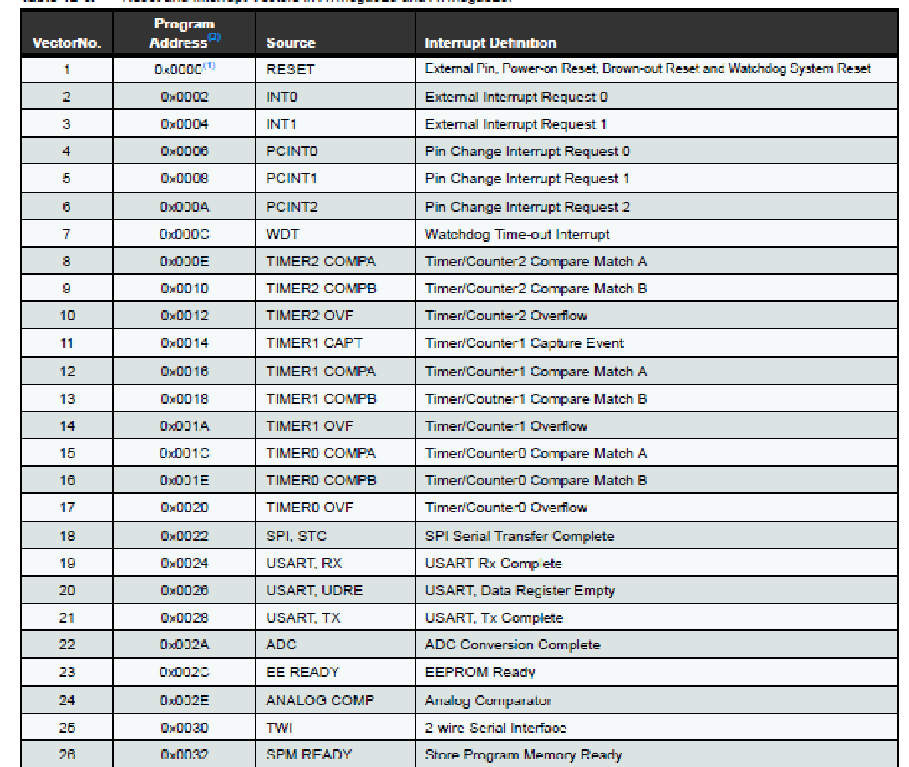
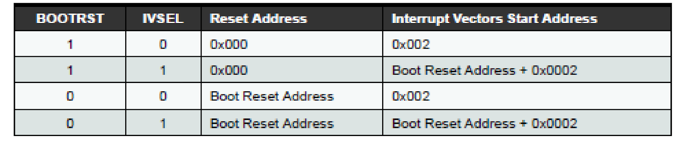
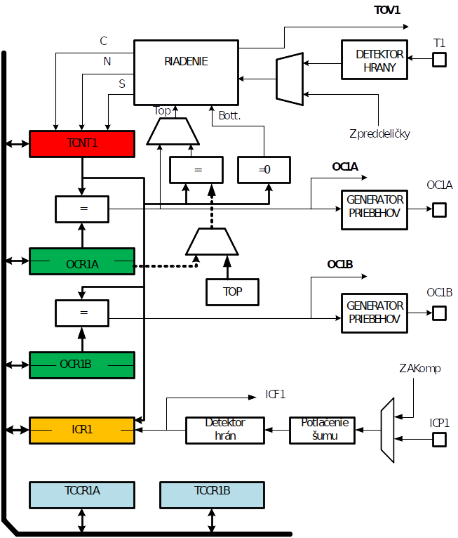

Asynchrónne vyskytujúce sa udalosti môžeme v prípade ATmeg328 obsluhovať dvoma spôsobmi. Prvý z nich vyžaduje programovo sa neustále dopytovať či definovaná udalosť (napríklad prijatie nového znaku do registra UDR0) už nastala. V prípade, že udalosť nastala, je potrebné túto udalosť obslúžiť (napr. presunúť znak z registra UDR0 do pamäte). V tomto prípade hovoríme o programovom styku procesora s perifériou.  

!!! example "Príklad"
	```c++
	int PrimUart::USART_receive_byte(FILE*stream)
	{
        uint8_t u8data;
        while(!(UCSR0A&(1<<RXC0))){};    //caka na splnenie podmienky
        u8data=UDR0;
        return u8data;
	};
	```
Na obsluhu takýchto náhodne vznikajúcich udalostí je vhodné využiť prerušovací systém. V tomto prípade nemusí procesor testovať a čakať, či už daná udalosť nastala, ale môže sa venovať iným činnostiam. Pri výskyte definovanej udalosti (prijatie znaku) sa automaticky preruší doterajšia činnosť procesora a začne sa vykonávať obsluha vzniknutej udalosti. Po obslúžení prerušenia sa procesor vráti do toho kroku, v ktorom bola jeho pôvodná činnosť prerušená a pokračuje v nej.

Ako to ceĺé funguje? Nech sa procesor venuje realizácii programu (spracováva jednotlivé inštrukcie programu). V istom okamžiku je generovaná žiadosť o prerušenie. Žiadosť môže byť generovaná len jedným z prípustných zdrojov. V našom MCU len zo zdrojov uvedených v tabuľke nižšie. Riadiaca jednotka prerušenia identifikuje zdroj, ktorý generoval žiadosť, vyhodnotí jeho prioritu a v prípade, že žiadosť je akceptovaná t.j. prerušenie je povolené a neprebieha obsluha prerušenia s vyššou prioritou, tak sa naplní programový čítač (PC) adresou (Program Address), ktorá zodpovedá vektoru prerušenia (2 až 26).  Poznamenajme, že čím je číslo prerušenia (to zodpovedá zdroju, ktorý žiadosť o prerušenie generoval, viď tabuľka nižšie) nižšie, tým je priorita prerušenia vyššia. Napr. v prípade generovania žiadosti od obvodu USART pri príjme znaku „USART RX Complete“ sa generuje žiadosť odpovedajúca vektoru 19 a PC sa naplní hodnotou 0x0024 (nech tabuľka vektorov začína na adr0x0002). Na tejto adrese je uložená prvá inštrukcia obsluhy prerušenia. Najčastejšie je to inštrukcia skoku na adresu konkrétnej obsluhy prerušenia. V tejto obsluhe sa vykonajú všetky potrebné úkony a po skončení obsluhy sa vykoná návrat z prerušenia do pôvodného programu. Pretože v prípade používania jazyka C/C++ sa o väčšinu uvedených činností stará kód, ktorý je generovaný prekladačom nebudeme sa zaoberať podrobným popisom. (O uchovávaní návratových adries v zásobníku a pod. sa ani nezmieňujeme).



Počiatočnú adresu tabuľky vektorov prerušenia je možné modifikovať pomocou vhodného nastavenia bitov BOOTRST a IVSEL v registri „Extended Fuse Byte“ a MCUCR.



*Zdroj: Katalógový list ATmega328*

Prerušenia na vývodoch  PCINT23 . . .0 sú rozdelené do troch skupín: 

- PCINT0 prináleží k	PCINT[7:0]

- PCINT1 prináleží k	PCINT[14:8]

- PCINT2 prináleží k	PCINT[23:16]

Prerušenie bude generované, ak:

1. je prerušenie povolené globálne, nastavením bitu I v registri stavu SREG,  
2. je povolené prerušenie  príslušnej skupiny v registri PCICR,
3. je povolené lokálne prerušenie v registroch PCMSKx,
4. a vyskytne sa ľubovoľná zmena stavu na príslušnom vývode MCU(H->L, alebo L->H)

Maska prerušenia **PCICR**:

| Bit     | 7    | 6    | 5    | 4    | 3    | 2     | 1     | 0     |
| ------- | ---- | ---- | ---- | ---- | ---- | ----- | ----- | ----- |
| Označ.  | -    | -    | -    | -    | -    | PCIE2 | PCIE1 | PCIE0 |
| Prístup | R    | R    | R    | R    | R    | R/W   | R/W   | R/W   |
| P.hodn. | 0    | 0    | 0    | 0    | 0    | 0     | 0     | 0     |

Príznak prerušenia **PCIFR**:

| bit     | 7    | 6    | 5    | 4    | 3    | 2     | 1     | 0     |
| ------- | ---- | ---- | ---- | ---- | ---- | ----- | ----- | ----- |
| Označ.  | -    | -    | -    | -    | -    | PCIF2 | PCIF1 | PCIF0 |
| Prístup | R    | R    | R    | R    | R    | R/W   | R/W   | R/W   |
| P.hodn. | 0    | 0    | 0    | 0    | 0    | 0     | 0     | 0     |

Príznak je nulovaný automaticky pri skončení zodpovedajúcej obsluhy prerušenia. Alternatívne zápisom logickej jednotky.

Lokálna maska prerušenia **PCMSK0**:

| bit     | 7      | 6      | 5      | 4      | 3      | 2      | 1      | 0      |
| ------- | ------ | ------ | ------ | ------ | ------ | ------ | ------ | ------ |
| Oznac.  | PCINT7 | PCINT6 | PCINT5 | PCINT4 | PCINT3 | PCINT2 | PCINT1 | PCINT0 |
| Pristup | R/W    | R/W    | R/W    | R/W    | R/W    | R/W    | R/W    | R/W    |
| P.hodn. | 0      | 0      | 0      | 0      | 0      | 0      | 0      | 0      |


Lokálna maska prerušenia **PCMSK1**:

| bit     | 7    | 6       | 5       | 4       | 3       | 2       | 1      | 0      |
| ------- | ---- | ------- | ------- | ------- | ------- | ------- | ------ | ------ |
| Oznac.  | -    | PCINT14 | PCINT13 | PCINT12 | PCINT11 | PCINT10 | PCINT9 | PCINT8 |
| Pristup | R    | R/W     | R/W     | R/W     | R/W     | R/W     | R/W    | R/W    |
| P.hodn. | 0    | 0       | 0       | 0       | 0       | 0       | 0      | 0      |

Lokálna maska prerušenia **PCMSK2**:

| bit     | 7       | 6       | 5       | 4       | 3       | 2       | 1       | 0       |
| ------- | ------- | ------- | ------- | ------- | ------- | ------- | ------- | ------- |
| Oznac.  | PCINT23 | PCINT22 | PCINT21 | PCINT20 | PCINT19 | PCINT18 | PCINT17 | PCINT16 |
| Pristup | R       | R/W     | R/W     | R/W     | R/W     | R/W     | R/W     | R/W     |
| P.hodn. | 0       | 0       | 0       | 0       | 0       | 0       | 0       | 0       |

### Úloha využitie ISR v triede "TLACIDLO"

Našou úlohou je využiť prerušovací systém na sledovanie stavu tlačidla USR. Pripomeňme, že tlačidlo je pripojené na vývod PB0 podľa obrázku. Potom je možné pri stlačení tlačidla generovať žiadosť o prerušenie, ak je povolené.  


lačidlo USR je pripojené na PB0 t.j. PCINT0, preto je potrebné nastaviť na hodnotu log.1 PCINT2 v registri PCMSK0,

PCIE0 v registri PCICR – povolenie prerušenia od skupiny PCINT0. Nakoniec povolíme celý prerušovací systém tak, že v stavovom registri, SREG nastavíme bit I na logickú 1. Toto je možné realizovať použitím makra `sei()` - **globálne povolenie prerušení**. Opakom makra `sei()` je makro `cli()` - **globálny zákaz prerušení**.

### Implementácia triedy TLACIDLO

=== "Hlavičkový súbor TLACIDLO.h"
    ``` c++
    #ifndef __TLACIDLO_H__
    #define __TLACIDLO_H__
    #include "BOARD_AVR.h"
    #include "RGB.h"
    
    //extern bool Tl_stav;
    
    class TLAC : RGB
    {
        //variables
    public:
    protected:
    private:
        //static bool Tl_stav;
        //functions
    public:
        TLAC();
        ~TLAC();
        bool Get_Tlacidlo(void);
    
        //	 bool Get_Tlacidlo_int(void);
        //static TLAC* tlacidlo_pointer;
    
        //static inline void obsluha_interruptTL(void);
        void Tlac_init(void);
    
    protected:
    private:
    }; //TLACIDLO
    
    #endif //__TLACIDLO_H__
    ```
=== "Definičný súbor TLACIDLO.cpp"
    ```c++
    #include "TLACIDLO.h"

    // default constructor
    TLAC::TLAC()
    {
        //	tlacidlo_pointer = this;
        sbi(PORTB, TL); //pull-up
        cbi(DDRB, TL);  // vstup
        //	Tl_stav = false;
    } //TLACIDLO
    
    // default destructor
    TLAC::~TLAC()
    {
        cbi(PCMSK0, PCINT0); // zakaz prerusenia od PB0
    } //~TLACIDLO
    
    bool TLAC::Get_Tlacidlo()
    {
        if ((PINB & (1 << TL)) == 0)
            return true;
        else
            return false;
    }
    
    void TLAC::Tlac_init()
    {
        sbi(PCICR, PCIE0);   //povolenie prerusenia 0-tej skupiny
        sbi(PCMSK0, PCINT0); // povolenie prerusenia od PB0 pri kazdej zmene
    }
    
    ISR(PCINT0_vect)
    {
        //TLAC::tlacidlo_pointer->obsluha_interruptTL();
        tbi(PORTD, LED_RED);
        _delay_ms(500);
        sbi(PCIFR, PCIF0); // vynulovanie priznaku prerusenia
    }
    ```

Príklad použitia:

=== "main.cpp"
    ``` c++
    #include "BOARD_AVR.h"
    #include "UART_BT.h"
    #include "TLACIDLO.h"

    int main(void)
    {
        UART_BT uart;
    
        uart.Uart_int();   // 115200 8N1
        uart.Uart_send("AVR_BOARD\r");
    
        TLAC tlac;
        tlac.Tlac_init();
        sei();
    
            while (1) 
            {
    
            }
    }
    ```
Uvedený príklad je veľmi jednoduchý, nie je to typická ukážka obsluhy prerušenia pri objektovom prístupe. Prerušovacia rutina ISR je statická. Poznamenávam, že čakanie 50 ms  v prerušovacej rutine nie je vhodné riešenie. 50 ms sú blokované žiadosti o prerušenie s nižšou prioritou, čo môže mať vo väčšine aplikácií fatálne následky. 


## Prerušenie od časovača T1- projekt AVR4

Na doplnenie uvedieme ešte jeden príklad prerušenia od interného zdroja – časovača T1. Najskôr zopár slov o časovači/čítači T1.

**Charakteristika:**

- 16-bitový čítač/časovač,  (16-bit PWM),
- dve nezávislé výstupné porovnávacie jednotky,
- výstupné porovnávacie registre,
- vstupná záchytná jednotka,
- vstup s potlačením šumu,
- nulovanie čítača pri zhode  (Auto Reload),
- Bez zákmitová fázovo korektná PWM,
- PWM s premenlivou periódou,
- frekvenčný generátor,
- čítač externých udalostí,
- štyri nezávislé zdroje prerušenia (TOV1, OCF1A, OCF1B, and ICF1).



**Čítač/časovač1**

V tabuľke prerušení si všimnime, že modul časovača T1 môže generovať žiadosť o prerušenie pri nasledovných udalostiach.

- TIMER1_CAPT
- TIMER1_COMPA
- TIMER1_COMPB
- TIMER1_OVF  

Najskôr však popíšeme niektoré registre, ktoré súvisia s čítačom/časovačom 1. Ich význam bezprostredne súvisí s programovým riešením.

### Register TCCR1A

| **Bit 		7** | **6**  | **5**  | **4**  | **3** | **2** | **1** | **0** |
| ----------------- | ------ | ------ | ------ | ----- | ----- | ----- | ----- |
| COM1A1            | COM1A0 | COM1B1 | COM1B0 | -     | -     | WGM11 | WGM10 |
| R/W               | R/W    | R/W    | R/W    |       |       | R/W   | R/W   |
| 0                 | 0      | 0      | 0      |       |       | 0     | 0     |

COM1A1, COM1A0  voľba režimu vývodu OC1A , COM1B1, COM1B0 voľba režimu vývodu OC1B. V režime časovač môže ostať pôvodné nastavenie. 

### Register TCCR1B

| Bit 		7 | 6     | 5    | 4     | 3     | 2    | 1    | 0    |
| ------------- | ----- | ---- | ----- | ----- | ---- | ---- | ---- |
| ICNC1         | ICES1 | -    | WGM13 | WGM12 | CS12 | CS11 | CS10 |
| R/W           | R/W   |      | R/W   | R/W   | R/W  | R/W  | R/W  |
| 0             | 0     |      | 0     | 0     | 0    | 0    | 0    |


ICNC1 - potlačenie šumu, ICES1 voľba hrany, WGM12, WGM13 voľba režimu, CS12, CS11, CS10 voľba hodín. V režime časovač môže ostať pôvodné nastavenie. Modifikujeme len voľbu hodín.

### Register TIMSK1

| Bit 		7 | 6    | 5    | 4    | 3    | 2     | 1     | 0    |
| ------------- | ---- | ---- | ---- | ---- | ----- | ----- | ---- |
| -             | -    | ICIE | -    | -    | OCIEB | OCIEA | TOIE |
|               |      | R/W  |      |      | R/W   | R/W   | R/W  |
|               |      | 0    |      |      | 0     | 0     | 0    |

Ak chceme lokálne povoliť prerušenie od jednotlivých zdrojov je potrebné príslušné bity nastaviť na hodnotu log.1.

### Register TCCR1C

| Bit 		7 | 6     | 5    | 4    | 3    | 2    | 1    | 0    |
| ------------- | ----- | ---- | ---- | ---- | ---- | ---- | ---- |
| FOC1A         | FOC1B | -    | -    | -    | -    | -    | -    |
| R/W           | R/W   |      |      |      |      |      |      |
| 0             | 0     |      |      |      |      |      |      |

FOC1A, FOC1B súvisia s riadením vývodov OC1A a OC1B. V režime časovač môže ostať pôvodné nastavenie.

Ďalšie registre čítača/časovača1:

- TCNT1 (H, L) 16-bitový register (prístup cez dva 8-bitové)  
- ICR1  (H, L)    16-bitový register
- OCR1A (H, L) 16-bitový porovnávací register A
- OCR1B (H, L) 16-bitový porovnávací register B

### Príklad použitia:
=== "PrerT1_OVF.h"
    ``` c++
    /* 
    * PrerT1_OVF.h
    *
    * Created: 6.7.2020 11:37:31
    * Author: Juraj
    */

    #ifndef __PRERT1_OVF_H__
    #define __PRERT1_OVF_H__
    
    #include "BOARD_AVR.h"
    
    #define STRINGIFY(name) #name
    
    #define CLASS_IRQ(name, vektor)                   \
        static void name(void) asm(STRINGIFY(vektor)) \
            __attribute__((signal, __INTR_ATTRS))
    
    #define TIMER1_TIMEOUT 64364; //  T_T = 65534 - //cas[s]/[(1/FCPU)*delic_hodin];   16-bit \
                                  //  100ms:	65536 - 0.1/(0.000000083*d1024) = 64364;
    
    /***************************************************/
    #define STRINGIFY(name) #name
    
    #define CLASS_IRQ(name, vektor)                   \
        static void name(void) asm(STRINGIFY(vektor)) \
            __attribute__((signal, __INTR_ATTRS))
    
    class PrerT1_OVF
    {
        //variables
    public:
    protected:
    private:
        volatile static uint16_t Timer1; //volatile
                                         //functions
    public:
        PrerT1_OVF();
        ~PrerT1_OVF();
        uint16_t getTim1(void);
        void setTim1(uint16_t);
        static void OverflowInterrupt1(void);
    
    private:
        // CLASS_IRQ(OverflowInterrupt1, TIMER1_OVF_vect);
    
    }; //PrerT1_OVF
    
    #endif //__PRERT1_OVF_H__
    ```

=== "PrerT1_OVF.cpp"
    ``` c++
    /* 
    * PrerT1_OVF.cpp
    *
    * Created: 6.7.2020 11:37:31
    * Author: Juraj
    */


    #include "PrerT1_OVF.h"
    
    volatile uint16_t PrerT1_OVF::Timer1;
    
    PrerT1_OVF::PrerT1_OVF()
    {
        PRR &=~(1<<PRTIM1);			// zapneme TIM0 napriek tomu, ze je def. zapnute
    
        uint8_t sreg = SREG;
        cli();						// atomicka operacia
        TCNT1 = TIMER1_TIMEOUT;
        SREG = sreg;
        TCCR1B |= d1024;			// nastavenie preddelicky clkio
        TIMSK1 |= (1<<TOIE1);		// povolenie prerusenia
        this->Timer1 = 0;
    }
    
    PrerT1_OVF::~PrerT1_OVF()
    {
        TIMSK1 &=~(1<<TOIE1);		// zakazanie prerusenia
        //	PRR |=(1<<PRTIM1);		// vypneme TIM0 ak chceme setrit, ale pozor nepojde nic
    }


    /**********************metody public*************************/
    uint16_t PrerT1_OVF::getTim1(void){
        return Timer1;
    }
    
    void  PrerT1_OVF::setTim1(uint16_t hod){
        Timer1 = hod;
    }


    void PrerT1_OVF::OverflowInterrupt1(void) 	// staticka funkcia, nemozeme pouzit this
    {
        // atomicka operacia
        cli();		// ak som sa ocitol tu, tak muselo byt glob. povolene prerusenie
        TCNT1 = TIMER1_TIMEOUT;		//restart
        sei();
        Timer1++;
    
    }
    
     ISR(TIMER1_OVF_vect){
        PrerT1_OVF::OverflowInterrupt1();
     }
    ```
Uvedieme ešte výpis `main()`. V programe je využitá obsluha prerušenia  od pretečenie časovača T1, PrerT1_OVF.

=== "main.cpp"
    ```c++
    /*
     * AVR4.cpp
     *
     * Created: 6.7.2020 11:22:27
     * Author : Juraj
     */
    ```

    #include "BOARD_AVR.h"
    #include "PrerT1_OVF.h"
    
    int main(void)
    {
        sbi(DDRD, LED_RED); // cervena svieti pri stlaceni
        sbi(DDRD, LED_BLUE);
        sbi(DDRD, LED_GREEN);
        _delay_ms(500);
    
        sbi(PORTD, LED_BLUE); // vsetko zhasne
        sbi(PORTD, LED_GREEN);
        sbi(PORTD, LED_RED);
    
        PrerT1_OVF timer11; // objekt timer11 nastavenie  konstruktore
    
        sei(); // globalne povolim prerusenie
    
        while (1)
        {
            if (timer11.getTim1() > 30)
            { // 30 * 100ms = 3s
                timer11.setTim1(0);
    
                cbi(PORTD, LED_GREEN); // zasvieti
                _delay_ms(50);
                sbi(PORTD, LED_GREEN); // zhasne
            }
        }
    }
    ```


Iste ste si všimli, že na ovládanie `RGB_LED` teraz nepoužívame už vytvorenú triedu. Nie je to zámer, je to len naša lenivosť. Svietenie/zhasnutie RGB je natoľko jednoduché, že sa nám nechce prilinkovať súbory RGB.h a RGB.cpp. Neskôr to upravíme. 


V úvode vytvoríme objekt triedy „ PrerT1_OVF. Vytvorený objekt sa volá „Timer11. Po vytvorení je možné využívať verejne prístupné metódy. V triede „PrerT1_OVF()“  sa nastavenie lokálnych parametrov realizuje v konštruktore triedy. Po spustení by mal program každé 3 sekundy bliknúť (50 ms) zelenou diódou.