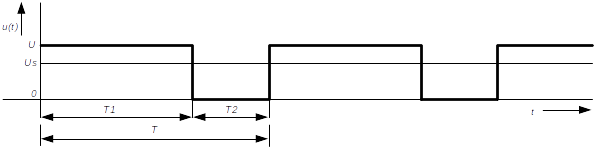
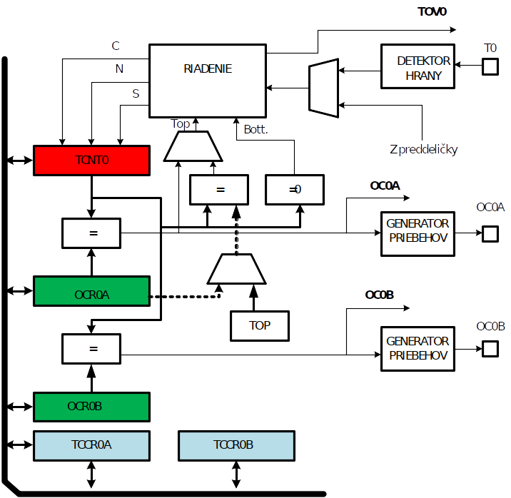
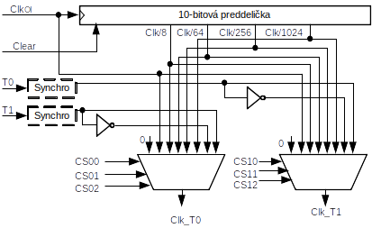
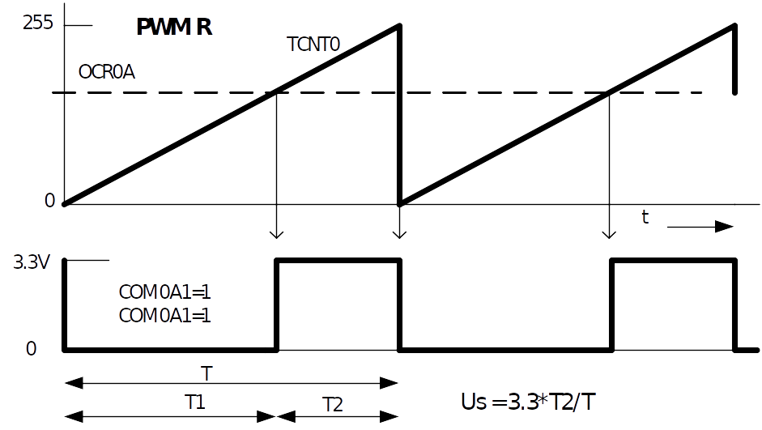

## Princíp činnosti

Ukážeme si generovanie šírkovo impulzne modulovaného signálu (PWM) programovými prostriedkami a následne aj pomocou 8-bitového čítača/časovača 0. Najskôr pár slov o samotnom signáli PWM. Typický priebeh signálu PWM je znázornený na obrázku. Vidíme, že signál *u(t)* nadobúda len dve hodnoty (U a 0). Predpokladajme, že je periodický s periódou *T*. Ďalej predpokladajme, že v rámci každej periódy dokážeme programovými prostriedkami meniť čas v ktorom signál nadobúda hodnotu *U*  a hodnotu *0*. Stredná hodnota periodického signálu *u(t)* je vo všeobecnosti daná vzťahom:
$$
U_S = \frac{1}{T}\int u(t)dt
$$

$$
U_S = \frac{1}{T}\int_{T} u(t)dt = \frac{T_1 U}{T_1+T_2}
$$
A v našom konkrétnom príklade predpokladáme, že $T_2 = 0.5 T_1$, potom je stredná hodnota napätia rovná: 
$$
U_S = \frac{T_1}{1.5 \times T_1}= 0.75U
$$
Ak naviac predpokladáme, že $U = 3,3V$, potom stredná hodnota napätia bude $0,75\times3,3 = 2,47V$.

Zmenou pomeru $T_1:T_2$ meníme strednú hodnotu signálu $u(t)$.

!!! question "Aká bude základná perióda PWM signálu?"
	Ak v priebehu 10s musíme plynule zvyšovať strednú hodnotu napätia, potom v rámci uvedeného času prejdeme 256 rôznych hodnôt plnenia. V prvom kroku začíname s hodnotami pre T1 = 0 a T2 = 256, v ďalšom T1 = 1 a T2 = 255 až posledný krok bude T1= 256 a T2 = 0.
	
	
!!! question "Aké musí byť maximálne rozlíšenie času??"
	Ak máme v priebehu 10s vykonať 256 krokov, potom jeden krok bude trvať $\frac{10}{256}  =  39 ms$. V každom kroku musíme byť schopný rozlíšiť 256 elementárnych časových úsekov. Preto rozlišovacia schopnosť musí byť $\frac{39}{256}= 153 us$. Programové riešenie úlohy je jednoduché. V záujme názornej ukážky sa budeme snažiť o čo  najjednoduchší prístup. Kód je uvedený nižšie.

```c++
#include "BOARD_AVR.h"

int main(void)
{
sbi(DDRD,LED_RED);  // smer
   	sbi(PORTD,LED_RED);  // zhasne
   
  
  	for(uint16_t i = 0; i<256; ++i)
  	{
	cbi(PORTD,LED_RED); // zasviet
		for(uint16_t k = 0; k<i; k++)_delay_us(153); // cakaj i.153
	 
   		sbi(PORTD,LED_RED);  // zhasni 
   		for(uint16_t l = 0; l<(255-i); l++) _delay_us(153); // cakaj (256-i)i.153
	}
   
   	while (1) 
    	{}
return 0;
}
```

Iste ste si všimli, že namiesto plynulého zvyšovaniu jasu je možné sledovať blikanie diódy. Je to spôsobené príliš nízkou frekvenciou signálu PWM. Pokúste sa upraviť kód tak, aby ste blikanie diódy nepostrehli a súčasne aby boli splnené zadané požiadavky 256 krokov v čase 10 s. 

Vidíme, že zadaná úloha je natoľko jednoduchá, že celý kód je napísaný v súbore main(), bez využitia  objektového prístupu. 

Poznamenajme, že v uvedenom riešení generovanie signálu plne vyťaží CPU mikrokontroléra. Preto, aby sa úlohy podobného typu dali riešiť efektívnejšie, väčšina mikrokontrolérov obsahuje integrované autonómne moduly, schopné generovať signál  s minimálnou intervenciou procesora. Jedným z takýchto modulov je modul čítača a časovača. Pri práci s MCU ATmega328 máme k dispozícii 3 moduly čítača/časovača. Jeden je 16-bitový a dva 8-bitové. Pripomeňme, že so 16-bitovým časovačom sme sa už stretli v projekte AVR4. Teraz na generovanie PWM signálu využijeme 8-bitový čítač/časovač0.

PWM signál s predchádzajúcej úlohy vyriešime s použitím modulu 8-bitového čítača/časovača0 (Č/Č0). Jeho štruktúra je uvedená na nasledujúcom obrázku.

## 8-bitový čítač/časovač 0



Z obrázka je zrejmé, že modul Č/Č0 má k dispozícii dva kanály na generovanie signálov PWM. Vývody, na ktorých generujeme signály PWM, sú označené OC0A a OC0B. Princíp činnosti a význam jednotlivých bitov riadiacich registrov bude vysvetlený v priebehu kurzu, preto uveďme len krátky popis dôležitých registrov.

### Riadiaci register časovača/čítača0 - A

| bit                        | 7          | 6          | 5          | 4          | 3     | 2     | 1         | 0         |
| -------------------------- | ---------- | ---------- | ---------- | ---------- | ----- | ----- | --------- | --------- |
| symbol                     | **COM0A1** | **COM0A0** | **COM0B1** | **COM0B0** | **-** | **-** | **WGM01** | **WGM00** |
| prístup                    | W          | R/W        | R/W        | R/W        | R     | R     | R/W       | R/W       |
| počiatočná 		hodnota | 0          | 0          | 0          | 0          | 0     | 0     | 0         | 0         |

**TCCR0A**

| **COM0A1** | **COM0A0** | **Popis**                                                    |
| ---------- | ---------- | ------------------------------------------------------------ |
| 0          | 0          | Normálna 		V/V funkcia, OC0A odpojené                  |
| 0          | 1          | Zmena 		výstupu OC0A na zhodu pri porovnávaní          |
| 1          | 0          | Nulovanie 		(nízka úroveň) OC0A na zhodu pri porovnávaní |
| 1          | 1          | Nastavenie 		(vysoká úroveň) OC0A na zhodu pri porovnávaní |
| **COM0B1** | **COM0B0** | **Popis**                                                    |
| 0          | 0          | Normálna 		V/V funkcia, OC0B odpojené                  |
| 0          | 1          | Zmena 		výstupu OC0B na zhodu pri porovnávaní          |
| 1          | 0          | Nulovanie 		(nízka úroveň) OC0B na zhodu pri porovnávaní |
| 1          | 1          | Nastavenie 		(vysoká úroveň) OC0B na zhodu pri porovnávaní |

Bit **FOC0**, Force Output Compare: Obsah bitu je aktívny len v prípade, ak modul nie je v režime PWM.Ak FOC0 je log.1, potom výsledok porovnania obsahov TCNT0 a OCR0 je vnútený do jednotky generátora priebehov. Výstup OC0 sa potom mení v súlade s nastavením bitov COM01 a COM00.


Bity **WGM00** a **WGM01**,Waveform Generator Mode: pomocou obsahu bitov WGM01:0 je možné riadiť smer čítača, určovať zdroj pre uchovanie hodnoty TOP a typ generátora priebehov. Možné režimy činnosti časovača/čítača sú nasledovné:

- normálny režim,

- nulovanie čítača pri zhode (CTC) režim,

- dva typy impulznej šírkovej modulácie. (rýchla PWM R a fázovo korektná PWM FK.)  

| Režim | **WGM02** | **WGM01** | **WGM00** | Režim 		činnosti | TOP  | update | TOV    |
| ----- | --------- | --------- | --------- | ---------------------- | ---- | ------ | ------ |
| 0     | 0         | 0         | 0         | Normálny               | 0xFF | Ihneď  | MAX    |
| 1     | 0         | 0         | 1         | PWM 		FK         | 0xFF | TOP    | BOTTOM |
| 2     | 0         | 1         | 0         | CTC                    | OCRA | Ihneď  | MAX    |
| 3     | 0         | 1         | 1         | PWM 		R          | 0xFF | BOTTOM | MAX    |
| 4     | 1         | 0         | 0         | Reserv.                | -    | -      | -      |
| 5     | 1         | 0         | 1         | PWM 		FK         | OCRA | TOP    | BOTTOM |
| 6     | 1         | 1         | 0         | Reserv.                | -    | -      | -      |
| 7     | 1         | 1         | 1         | PWM 		R          | OCRA | BOTTOM | TOP    |

MAX= 0xFF,  BOTTOM = 0x00

Pomocou obsahu bitov **COM01** a **COM00**, Compare Output Mode sa riadi správanie výstupného vývoduPB3 (OC0). Ak aspoň jeden z bitov COM01:0 obsahuje logickú jednotku, potom je na vývod OC0 pripojený zdroj signálu podľa tab.8. Popis uvedený v tabuľke 7 platí v prípade, ak sú bity WGM01:0 nastavené tak, že definujú normálny alebo CTC režim.

### Riadiaci register časovača/čítača0 - B

| bit                        | 7         | 6         | 5     | 4     | 3         | 2        | 1        | 0        |
| -------------------------- | --------- | --------- | ----- | ----- | --------- | -------- | -------- | -------- |
| symbol                     | **FOC0A** | **FOC0B** | **-** | **-** | **WGM02** | **CS02** | **CS01** | **CS00** |
| prístup                    | W         | R/W       | R/W   | R/W   | R         | R        | R/W      | R/W      |
| počiatočná 		hodnota | 0         | 0         | 0     | 0     | 0         | 0        | 0        | 0        |

**TCCR0B**

**FOC0A, B** len pri PWM. Výsledok porovnania je vnútený na výstup OC0A, B

**WGM02** viď. predchádzajúci text 

Bity **CS02 až CS00,** Clock Select určujú zdroj hodinového signálu pre časovač/čítač0, podľa tabuľky.

| **CS02** | **CS01** | **CS00** | **Popis**                                                    |
| -------- | -------- | -------- | ------------------------------------------------------------ |
| 0        | 0        | 0        | Nie 		je vybraný žiadny zdroj hodinového signálu (STOP) |
| 0        | 0        | 1        | ClkIO 		               ( bez preddeličky)              |
| 0        | 1        | 0        | ClkIO/8 		( výstup preddeličky)                        |
| 0        | 1        | 1        | ClkOI/64 		    ( výstup preddeličky)                   |
| 1        | 0        | 0        | ClkIO/256 		  ( výstup preddeličky)                    |
| 1        | 0        | 1        | ClkIO/1024 		( výstup preddeličky)                     |
| 1        | 1        | 0        | Externý 		zdroj hodinového signálu na vstupe T0, zostupná hrana. |
| 1        | 1        | 1        | Externý 		zdroj hodinového signálu na vstupe T0, nábežná hrana. |

>  Výber zdroja hodinového signálu
>
> 

### Register čítača/časovača 0

| Bit             | 7                       | 6    | 5    | 4    | 3    | 2    | 1    | 0    |
| --------------- | ----------------------- | ---- | ---- | ---- | ---- | ---- | ---- | ---- |
| Symbol          | **TCTN0 		  7:0** |      |      |      |      |      |      |      |
| Prístup         | R/W                     | R/W  | R/W  | R/W  | R/W  | R/W  | R/W  | R/W  |
| P. 		hod. | 0                       | 0    | 0    | 0    | 0    | 0    | 0    | 0    |

**TCNT0**

Register časovača/čítača umožňuje zapisovať a čítať obsah časovača/čítača0. Zápis do registra TCNT0 blokuje v nasledujúcej perióde hodín operáciu porovnania. Preto sa pri zmene obsahu registra TCNT0 počas činnosti čítača stretávame s rizikom straty zhody obsahov TCNT0 a OCR0.

### Výstupný porovnávací register A, B 

| Bit             | 7                        | 6    | 5    | 4    | 3    | 2    | 1    | 0    |
| --------------- | ------------------------ | ---- | ---- | ---- | ---- | ---- | ---- | ---- |
| Symbol          | **OCR0 		    7:0** |      |      |      |      |      |      |      |
| Prístup         | R/W                      | R/W  | R/W  | R/W  | R/W  | R/W  | R/W  | R/W  |
| P. 		hod. | 0                        | 0    | 0    | 0    | 0    | 0    | 0    | 0    |

**OCR0A, B**

> Princíp činnosti generovania PWM.
>
> 

## Implementácia triedy PWM0

=== "Hlavičkový súbor PWM0.h"
    ``` c++
    #ifndef __PWM0_H__
    #define __PWM0_H__
    #include "BOARD_AVR.h"
    ```

    class PWM0
    {
        //variables
    public:
    protected:
    private:
        //functions
    public:
        PWM0();
        ~PWM0();
    
        void Set_PWM(uint8_t, kanal); //hodnota od 0 do 255, kanal 1...A, 2
    protected:
    }; //PWM0
    
    #endif //__PWM0_H__
    ```

=== "Definičný súbor triedy PWM0.cpp"
    ``` c++
    #include "PWM0.h"
    ```

        // default constructor
        PWM0::PWM0()
    {
        cbi(PRR, PRTIM0);	// enable TIM0
        sbi(DDRD, PORTD6);	// vystup
        sbi(DDRD, PORTD5);	//vystup
        sbi(PORTD, PORTD6); // vystup
        sbi(PORTD, PORTD5);
    
        TCCR0A = (1 << WGM00) | (1 << WGM01); //rychla PWM, f.korektna 01
        TCCR0B = 4;							  // (12000000/256)/256 = 183 Hz opaovacia f PWM
    
        sbi(TCCR0A, COM0A1); // nul na zhodu  kanal A
        cbi(TCCR0A, COM0A0);
    
        sbi(TCCR0A, COM0B1); //nul na zhodu kanal B
        cbi(TCCR0A, COM0B0);
    
    } //PWM0
    
    // default destructor
    PWM0::~PWM0()
    {
        sbi(PRR, PRTIM0); // disable TIM2
    } //~PWM0
    
    void PWM0::Set_PWM(uint8_t x, kanal k)
    { //x= 0 ...255,  A, B
        switch (k)
        {
        case 0:
            OCR0A = x;
            break;
    
        case 1:
            OCR0B = x;
            break;
    
        default:
            break;
        }
    }
    ```

Uveďme ešte jednoduchý súbor `main()`, ktorý slúži len na overenie činnosti PWM. Obvodové riešenie modulu AVR-Board neumožňuje jednoducho riešiť zadanú úlohu. RGB LED dióda je priamo pripojená na vývody PD2, PD4 a PD7, ktoré nie je možné mapovať na OC0A a OC0B.  Má niekto nápad ako to vyriešiť?  (Pomôcka: použite prerušenie na zhodu obsahov TCTN0 a OCR0x).

=== "main.cpp"
    ```c++
    #include "BOARD_AVR.h"
    #include "PWM0.h"

    int main(void)
    {
        PWM0 pwm0;
        pwm0.Set_PWM(128, A);
    
    while (1) 
            {}
    }
    ```

!!! question "Akú hodnotu napätia nameriame na vývode 1 modulu AVR board?"

!!! bug "Úloha"
	Vytvorte generátor pílovitého/harmonického priebehu so zadanou frekvenciou.	